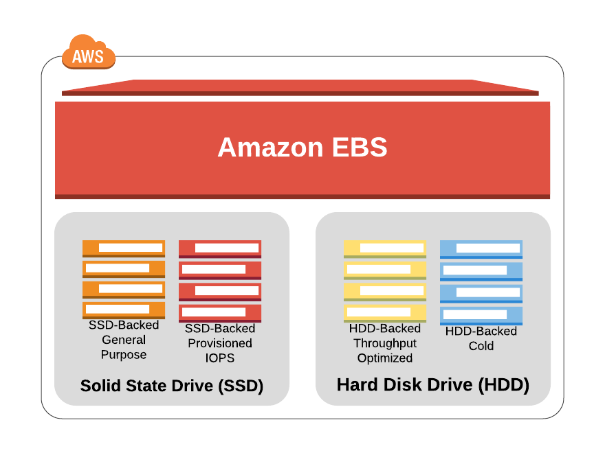

[<< Back to root module](../01-Theory.md)

## Elastic Block Storage (EBS)

## Table of Content

- [EBS Volume Types](#ebs-volume-types)
- [EBS Best Practices](#ebs-best-practices)
- [EBS Snapshots](#ebs-snapshots)
- [EBS Multi-Attach](#ebs-multi-attach)
- [EBS Encryption](#ebs-encryption)
- [EBS Migration](#ebs-migration)
- [EBS vs Instance Store](#ebs-vs-instance-store)
- [Considerations](#considerations)
- [Governance](#governance)
- [Pricing considerations](#pricing-considerations)
- [More details](#more-details)

Amazon Elastic Block Store (EBS) is an easy to use, high-performance, block-storage service designed for use with Amazon Elastic Compute Cloud (EC2) for both throughput and transaction intensive workloads at any scale. A broad range of workloads, such as relational and non-relational databases, enterprise applications, containerized applications, big data analytics engines, file systems, and media workflows are widely deployed on Amazon EBS.

You can choose from six different volume types to balance optimal price and performance. You can achieve single-digit-millisecond latency for high-performance database workloads such as SAP HANA or gigabyte per second throughput for large, sequential workloads such as Hadoop. You can change volume types, tune performance, or increase volume size without disrupting your critical applications, so you have cost-effective storage when you need it.

Designed for mission-critical systems, EBS volumes are replicated within an Availability Zone (AZ) and can easily scale to petabytes of data. Also, you can use EBS Snapshots with automated lifecycle policies to back up your volumes in Amazon S3, while ensuring geographic protection of your data and business continuity.

## EBS Volume Types

Amazon EBS provides multiple volume types that allow you to optimize storage performance and cost for a broad range of applications. These volume types are divided into two major categories: SSD-backed storage for transactional workloads, such as databases, virtual desktops and boot volumes, and HDD-backed storage for throughput intensive workloads, such as MapReduce and log processing.

General volume types are:

1. SSD-based volumes:
    - General Purpose Volumes gp2, gp3
    - Provisioned IOPS Volume io1, io2, io2 Block Express

2. HDD-based volumes:
    - Throughput Optimized HDD volumes st1
    - Cold HDD Volumes sc1

## EBS Best Practices

[Best practice rules for Amazon Elastic Block Store (EBS) from TrendMicro](https://www.trendmicro.com/cloudoneconformity/knowledge-base/aws/EBS/)

## EBS Snapshots

- Incremental – only backup changed blocks
- EBS backups use IO and you shouldn’t run them while your application is handling a lot of traffic
- Snapshots will be stored in S3 (but you won't directly see them)
- Not necessary to detach volume to do snapshots, but recommended
- Max 100000 snapshots
- Can copy snapshots cross AZ or Region
- Can make Image (AMI) from snapshots
- EBS volumes restored by snapshots need to be pre-warmed (using fio or dd command to read the entire volume)
- Snapshots can be automated using Amazon Data Lifecycle Manager

See [documentation](https://docs.aws.amazon.com/AWSEC2/latest/UserGuide/EBSSnapshots.html) for details

## EBS Multi-Attach

Mission-critical applications relying on highly performat and low latency access to data (such as business intelligence platforms) require resilient and highly available (HA) architecture. Implementing active-active and active-standby architectures with shared storage in cloud environments is now possible with introduction of EBS Multi-Attach enabled EBS volumes. Multi-Attach, coupled with Cluster Volume Manager (CVM), offers functionality to further segment shared volumes and create instant volume snapshots of datasets for resiliency in addition to rapid prototyping needs.

Amazon EBS Multi-Attach enables you to attach a single Provisioned IOPS SSD ( io1 or io2 ) volume to multiple instances(up to 16 Linux instances runnning on Nitro systems) that are in the same Availability Zone. You can attach multiple Multi-Attach enabled volumes to an instance or set of instances.

See [documentation](https://docs.aws.amazon.com/AWSEC2/latest/UserGuide/ebs-volumes-multi.html) for details

## EBS Encryption

- When you create an encrypted EBS volume, you get the following:
    - Data at rest is encrypted inside the volume
    - All the data in flight moving between the instance and the volume is encrypted
    - All snapshots are encrypted
    - All volumes created from the snapshots
- Encryption and decryption are handled transparently (you have nothing to do)
- Encryption has a minimal impact on latency
- EBS encryption leverages keys from KMS (AES-256)
- Copying an encrypted snapshot allows encryption
- Snapshots of encrypted volumes are encrypted

See [documentation](https://docs.aws.amazon.com/AWSEC2/latest/UserGuide/EBSEncryption.html) for details

## EBS Migration

- EBS Volumes are only locked to specific AZ
- To migrate it to a different AZ (or region):
    - [Snapshot the volume](https://docs.aws.amazon.com/AWSEC2/latest/UserGuide/ebs-creating-snapshot.html)
    - (optional) [Copy the volume](https://docs.aws.amazon.com/AWSEC2/latest/UserGuide/ebs-copy-snapshot.html) to a different region
    - Create a volume from the snapshot in the AZ of your choice

## EBS vs Instance Store:
- Some instances do not come with Root EBS volumes (which are "ephemeral")
- Instance store is physically attached to the machine (EBS is a network drive)

  #### Pros:
  - Better I/O performance
  - Good for buffer/cache/scratch data/temporary content
  - Data survives reboots

  #### Cons:
  - On stop or termination, the instance store is lost
  - You can't resize the instance store
  - Backups must be operated by the user

## Considerations

General Purpose SSD volumes (gp2 and gp3) balance price and performance for a wide variety of transactional workloads. These volumes are ideal for use cases such as boot volumes, medium-size single instance databases, and development and test environments.

Provisioned IOPS SSD volumes (io1 and io2) support up to 64,000 IOPS and 1,000 MiB/s of throughput. This enables you to predictably scale to tens of thousands of IOPS per EC2 instance.

Throughput Optimized HDD volumes (st1) provide low-cost magnetic storage that defines performance in terms of throughput rather than IOPS. These volumes are ideal for large, sequential workloads such as Amazon EMR, ETL, data warehouses, and log processing.

Cold HDD volumes (sc1) provide low-cost magnetic storage that defines performance in terms of throughput rather than IOPS. These volumes are ideal for large, sequential, cold-data workloads. If you require infrequent access to your data and are looking to save costs, these volumes provide inexpensive block storage.

## Governance

There are different metrics available for EBS volumes:
- [Amazon EBS metrics](https://docs.aws.amazon.com/AWSEC2/latest/UserGuide/using_cloudwatch_ebs.html#ebs-metrics)
- [Dimensions for Amazon EBS metrics](https://docs.aws.amazon.com/AWSEC2/latest/UserGuide/using_cloudwatch_ebs.html#ebs-metric-dimensions)
- [Graphs in the Amazon EC2 console](https://docs.aws.amazon.com/AWSEC2/latest/UserGuide/using_cloudwatch_ebs.html#graphs-in-the-aws-management-console-2)

You can back up the data on your Amazon EBS volumes to Amazon S3 by taking point-in-time snapshots. [Snapshots](https://aws.amazon.com/ebs/snapshots/) are incremental backups, which means that only the blocks on the device that have changed after your most recent snapshot are saved.

[Amazon Data Lifecycle Manager](https://docs.aws.amazon.com/AWSEC2/latest/UserGuide/snapshot-lifecycle.html) can be used to automate the creation, retention, and deletion of snapshots that you use to back up your Amazon EBS volumes.

## Pricing considerations

All info regarding EBS pricing can be found in [AWS docs](https://aws.amazon.com/ebs/pricing/)

## More details

- [Amazon Elastic Block Store (EBS)](https://aws.amazon.com/ebs/)
- [Amazon EBS volume types](https://aws.amazon.com/ebs/volume-types/)
- [Amazon EBS Snapshots](https://aws.amazon.com/ebs/snapshots/)
- [Amazon Elastic Block Store (Amazon EBS)](https://docs.aws.amazon.com/AWSEC2/latest/UserGuide/AmazonEBS.html)
- [AWS re:Invent 2019: Deep dive on Amazon EBS](https://www.youtube.com/watch?v=wsMWANWNoqQ)
- [Amazon Elastic Block Store (EBS) Overview](https://www.youtube.com/watch?v=77qLAl-lRpo)

[<< Back to root module](../01-Theory.md)
