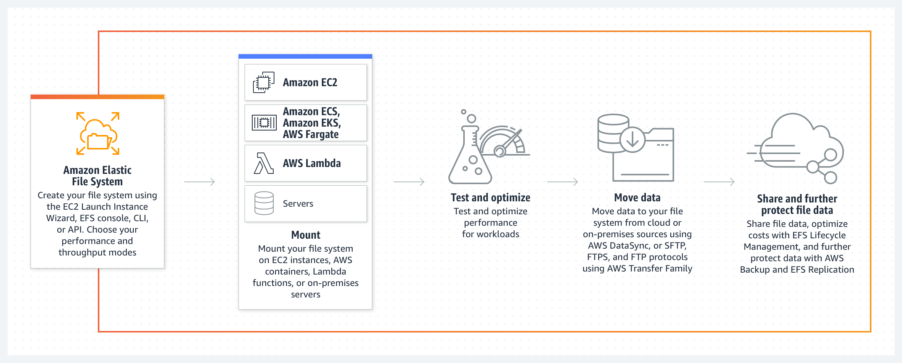
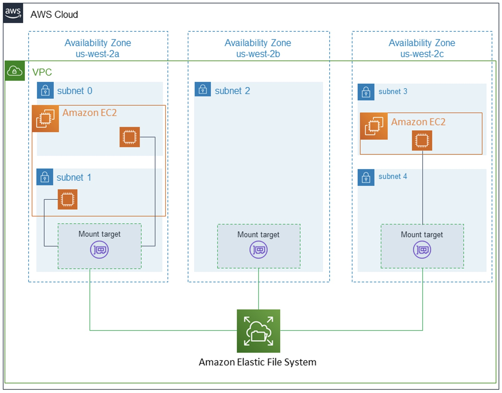
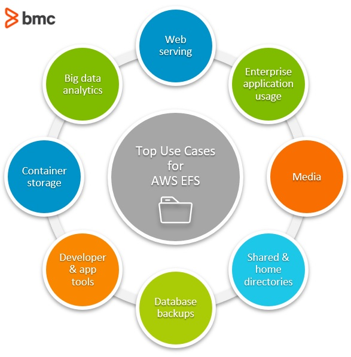

[<< Back to root module](../01-Theory.md)

## Elastic File System (EFS)

### Table of Content

- [EFS Best Practices](#efs-best-practices)
- [EFS Backup Solutions](#efs-backup-solutions)
- [Use cases](#use-cases)
- [Pricing considerations](#pricing-considerations)
- [More details](#more-details)

**Amazon EFS** is an AWS file sharing service that lets you manage file shares, like those used on traditional networks, and mount them on cloud or on-premises machines using the **NFSv4 protocol**.

It is a scalable, cloud-based file system for Linux-based applications and workloads that can be used in combination with AWS cloud services and on-premise resources. EFS offers a choice between two storage classes:
- Standard access - is designed for frequently accessed files
- Infrequent Access (EFS-IA) - is developed for storing long-lived but less used files at a lower cost

### EFS key features:

- **Shared Storage**  
  Files are accessible from AWS services as well as from on-premise. They can be simultaneously accessed by up to a thousand EC2 instances within the cloud or via VPN or AWS Direct Connect, making EFS good for hybrid solutions. File access is possible across multiple AWS Availability Zones (AZs) and Regions, for easier collaboration and global remote work.

- **Scalable Performance**  
  EFS is designed for low latency with IOPS and throughput that scale with usage and the number of attached instances, meaning that as storage size grows, performance increases. At peak performance, it offers 10 GB/sec throughput and 500k IOPS. EFS scales automatically as data is moved in or out, minimizing fears of running out of space or paying for storage you aren’t using. Learn more about how file sharing impacts cloud scalability and agility.

- **Secure and Compliant**  
  EFS allows multiple layers of security and relies on your existing security infrastructure. It can be used with Amazon's Identity and Access Management (IAM) roles as well as VPC security groups and allows you to define individual file permissions using POSIX. EFS has built-in compliance with common regulatory standards, including PCI DSS, HIPAA, and SOC with the ability to meet others if necessary. Learn more about best practices for secure cloud file sharing.

### Typical EFS deployment diagram:

## EFS Best Practices

- [Security in Amazon EFS](https://docs.aws.amazon.com/efs/latest/ug/security-considerations.html)
- [AWS re:Invent 2020: Amazon EFS performance best practices](https://www.youtube.com/watch?v=nLkWUQfgArc&ab_channel=AWSEvents)
- [AWS re:Invent 2020: Security best practices with Amazon EFS](https://www.youtube.com/watch?v=tIK6BBo_9n0&ab_channel=AWSEvents)

### Advantages to using an EFS

- An Amazon EFS is elastic. That means its storage capacity can be automatically scaled up (add more storage) or scaled down (shrink storage capacity) as folders and files are added to or removed from the system. This is a major advantage over traditional storage solutions—you can add or remove capacity without disrupting users or applications.
- Importantly, EFS storage is permanent. When attached to an AWS compute instance, data will not disappear when that instance is relaunched.

### Disadvantages to using an EFS

Amazon EFSs do have a couple limitations:
- No Windows instances. Amazon EFSs are not supported on AWS Windows EC2 instances. EFS volumes can only be used with non-Windows instances, such as Linux, that support NFS volumes.
- No system boot volumes. Amazon EFS volumes also cannot be used for system boot volumes. AWS EC2 instances must use Elastic Block Store (EBS) volumes for booting their systems. EBS volumes are like EFS volumes with one exception. An EBS volume can only be connected to one EC2 instance or server, while EFS volumes can be connected to several EC2 instances and on-premises resources.

## EFS Backup Solutions

Since a storage solution is only really useful when it can be backed up, you should be aware of your [backup options with EFS](https://cloud.netapp.com/blog/efs-backup-methods). Keep in mind, other ways exist if you want to use third-party products integrated with AWS. Also, learn more about general considerations for backup and archiving in the cloud.

**AWS Backup** is a fully managed service that allows you to create, manage, and automate incremental backups according to a schedule you define through a central location. This system is PCI and ISO compliant and HIPAA eligible, to ensure that your compliance needs are covered. It is possible to use AWS Backup whether your system has a cloud-native, hybrid, or on-premise configuration.This solution is easy to implement, and incremental backups help keep your costs low but requires manually pausing the applications and processes being backed up and only allows backups to be stored on EFS. [Amazon Backup Service](https://aws.amazon.com/backup/)

**There is no built-in EFS backup**, and EFS does not have a native snapshot mechanism. So, before AWS Backup was released, backups had to be done using a template in AWS CloudFormation. This involves using scripts to access the AWS Data Pipeline, from which you must transfer data between multiple services before finally storing the backed-up data in EFS. With this process, you are still able to control backup schedules and life cycles as with the AWS Backup Service.The main downsides of this option are that it does require some programming knowledge and is not easily monitored. Additionally, if you are not careful to change time constraints according to the amount of data you are backing up, your process can fail. [EFS to EFS Backup](https://aws.amazon.com/solutions/implementations/efs-to-efs-backup-solution/)

**Backing up your data to S3** is another option you might consider and one that can help decrease your storage costs. This process begins the same as the EFS to EFS backup but rather than moving the incremental backups from S3 to EFS at the end of the process, they are simply left in S3. Like EFS to EFS, you can schedule your backups and manage life cycle length but you must also have some programming ability and be familiar with the use of scripts for automating processes. [Backing Up to Amazon S3](https://aws.amazon.com/getting-started/hands-on/backup-files-to-amazon-s3/)

### Use cases

An EFS is suitable for the following use cases:
- Web serving and content management
- Enterprise application usage
- Media and entertainment
- Shared and home directories
- Database backups
- Developer and application tools
- Container storage
- Big data analytics
- Other applications where you need to connect a common data source to a single server or multiple servers

### Pricing considerations

With Amazon EFS, you pay only for the storage used by your file system and there is no minimum fee or setup cost.

Amazon EFS offers a range of storage classes designed for different use cases. These include:
- Standard storage classes – EFS Standard and EFS Standard–Infrequent Access (Standard–IA), which offer multi-AZ resilience and the highest levels of durability and availability
- One Zone storage classes – EFS One Zone and EFS One Zone–Infrequent Access (EFS One Zone–IA), which offer customers the choice of additional savings by choosing to save their data in a single AZ

For more information, see [Managing EFS storage classes](https://docs.aws.amazon.com/efs/latest/ug/storage-classes.html).

Costs related to Provisioned Throughput are determined by the throughput values you specify. For more information, see [Amazon EFS Pricing](https://aws.amazon.com/efs/pricing)

### More details:

- [What is Amazon Elastic File System?](https://docs.aws.amazon.com/efs/latest/ug/index.html)
- [AWS EFS: Is It the Right Storage Solution for You?](https://cloud.netapp.com/blog/aws-efs-is-it-the-right-storage-solution-for-you)
- [Amazon’s Elastic File System (EFS) Explained](https://www.bmc.com/blogs/aws-efs-elastic-file-system/)
- [EFS Backup: Backing Up NFS Data in AWS](https://cloud.netapp.com/blog/efs-backup-methods)
- [AWS EFS Performance Do’s and Dont's](https://cloud.netapp.com/blog/efs-performance-dos-and-donts-aws-cvo-blg)

[<< Back to root module](../01-Theory.md)
