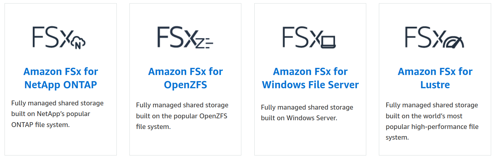
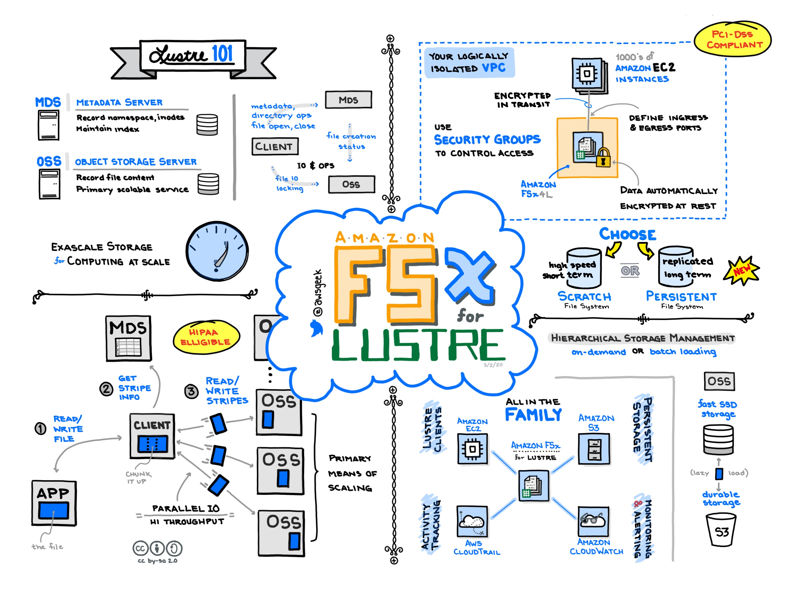
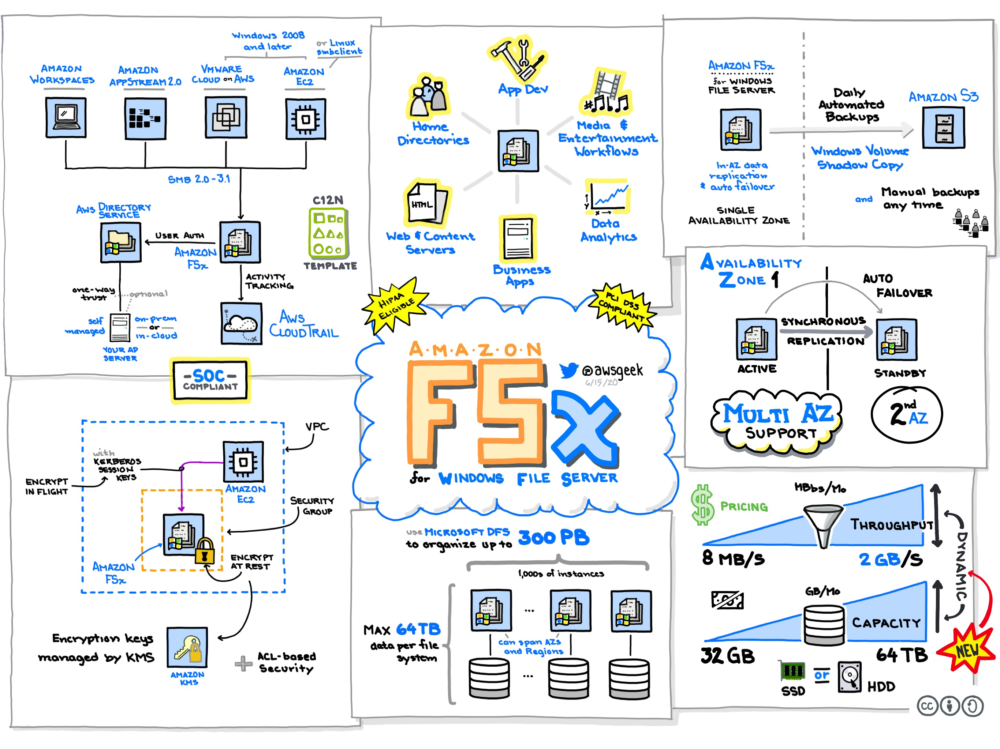

[<< Back to root module](../01-Theory.md)

## Amazone FSx

### Table of Content

- [Choosing an Amazon FSx File System](#choosing-an-amazon-fsx-file-system)
- [Amazon FSx for Lustre](#amazon-fsx-for-lustre)
- [Amazon FSX for OpenZFS](#amazon-fsx-for-openzfs)
- [Amazon FSx for Windows File Server](#amazon-fsx-for-windows-file-server)
- [Amazon FSX for NetApp ONTAP](#amazon-fsx-for-netapp-ontap)
- [More details](#more-details)

Amazon FSx provides fully managed third-party file systems.

Amazon FSx provides you with the native compatibility of third-party file systems with feature sets for workloads such as Windows-based storage, high-performance computing (HPC), machine learning, and electronic design automation (EDA).

You don’t have to worry about managing file servers and storage, as Amazon FSx automates the time-consuming administration tasks such as hardware provisioning, software configuration, patching, and backups.

Amazon FSx integrates the file systems with cloud-native AWS services, making them even more useful for a broader set of workloads.

Amazon FSx provides you with four file systems to choose from:

   - Amazon FSx for Lustre for compute-intensive workloads
   - Amazon FSX for OpenZFS
   - Amazon FSx for Windows File Server for Windows-based applications
   - Amazon FSx for NetApp ONTAP

## Choosing an Amazon FSx File System

| Parameter | FSx for NetApp ONTAP | FSx for OpenZFS | FSx for Windows File Server | FSx for Lustre |
|-----------|--------|-----|---------|-------|
| Latency          |<1 ms        |<0.5 ms     |<1 ms         |<1 ms       |
| Max. throughput per file system |  4-6 GB/s |8-21 GB/s  | 2-3 GB/s  |1000 GB/s |
| Maximum file system size |Virtually unlimited(100s of PBs)|512 TiB |64 TiB|Multiple PBs|
|Client compatibility|Windows, Linux, macOS|Windows, Linux, macOS|Windows, Linux, macOS|Linux|
|Protocol support|SMB 2.0, 2.1, 3.0, 3.1.1, NFS 3, 4.0, 4.1, 4.2, iSCSI (shared block storage)|NFS 3, 4.0, 4.1, 4.2|SMB 2.0, 2.1, 3.0, 3.1.1|Custom (POSIX-compliant) protocol optimized for performance|
|Cost-optimized storage for cold, infrequently-accessed data|Low-cost tier with cold data automatically cycled to it||HDD storage option|HDD storage option|
|Data deduplication|Yes||Yes||
|Deployment options|Single-AZ and Multi-AZ|Single-AZ|Single-AZ and Multi-AZ|Single-AZ - Persistent or Scratch|
|Cross-region/cross-account backups||Yes (Cross-region)|Yes|Yes|
|Access Control Lists (ACLs)|NFS 4.0, v4.1, NTFS||NTFS||

*[source](https://aws.amazon.com/fsx/when-to-choose-fsx/)

## Amazon FSx for Lustre

Amazon FSx for Lustre provides a high-performance file system optimized for fast processing of workloads such as machine learning, high performance computing (HPC), video processing, financial modeling, and electronic design automation (EDA).
These workloads commonly require data to be presented via a fast and scalable file system interface, and typically have data sets stored on long-term data stores like Amazon S3.

Amazon FSx for Lustre provides a fully managed high-performance Lustre file system that allows file-based applications to access data with hundreds of gigabytes per second of data, millions of IOPS, and sub millisecond latencies.

Amazon FSx works natively with Amazon S3, letting you transparently access your S3 objects as files on Amazon FSx to run analyses for hours to months.

You can then write results back to S3, and simply delete your file system. FSx for Lustre also enables you to burst your data processing workloads from on-premises to AWS, by allowing you to access your FSx file system over AWS Direct Connect or VPN.

You can also use FSx for Lustre as a standalone high-performance file system to burst your workloads from on-premises to the cloud.

By copying on-premises data to an FSx for Lustre file system, you can make that data available for fast processing by compute instances running on AWS. Metadata stored on Metadata Targets (MST).
Performance is based on the size of the filesystem.

### Pricing considerations

With Amazon FSx for Lustre, there are no upfront hardware or software costs. You pay for only the resources used, with no minimum commitments, setup costs, or additional fees. For information about the pricing and fees associated with the service, see [Amazon FSx for Lustre Pricing](http://aws.amazon.com/fsx/lustre/pricing).

## Amazon FSX for OpenZFS

Amazon FSx for OpenZFS is a fully managed file storage service that makes it easy to move data to AWS from on-premises ZFS or other Linux-based file servers. You can do this without changing your application code or how you manage data. It offers highly reliable, scalable, performance, and feature-rich file storage built on the open-source OpenZFS file system. It combines these capabilities with the agility, scalability, and simplicity of a fully managed AWS service.

Amazon FSx for OpenZFS file systems are broadly accessible from Linux, Windows, and macOS compute instances and containers using the industry-standard NFS protocol. Powered by the latest AWS compute, disk, and networking technologies, including AWS Scalable Reliable Datagram networking and the AWS Nitro system, Amazon FSx for OpenZFS delivers up to 2 million IOPS with latencies of hundreds of microseconds. With complete support for OpenZFS features like instant point-in-time snapshots and data cloning, FSx for OpenZFS makes it easy for you to replace your on-premises file servers with AWS storage that provides familiar file system capabilities and eliminates the need to perform lengthy qualifications and change or re-architect existing applications or tools

Highly available and highly durable file systems.Support for multiple volumes per file system, thin provisioning, and user and group quotas for cost-efficient shared file systems across multiple users and applications.

Support for the following data protection and security features:

    - Built-in, fully managed file system backups stored on S3, with support for cross-region backup copies.
    - Near-instant point-in-time OpenZFS snapshots stored locally on each file system.
    - Automatic encryption of file system data and backups at rest using KMS keys.
    - Automatic encryption in-transit when accessed from supported EC2 instances.

### Pricing considerations

You are billed for file systems based on the following categories:

    - SSD storage capacity (per gigabtye-month, or GB-month)
    - Throughput capacity (per MB/s-month)
    - Optional SSD IOPS that you provision above the default 3 IOPS/GB (per IOPS-month)
    - Backup storage consumption (per GB-month)

For more information about pricing and fees associated with the service, see [FSx for OpenZFS pricing](http://aws.amazon.com/fsx/openzfs/pricing/).

## Amazon FSx for Windows File Server

Amazon FSx for Windows File Server provides fully managed Microsoft Windows file servers, backed by a fully native Windows file system. Amazon FSx for Windows File Server has the features, performance, and compatibility to easily lift and shift enterprise applications to the AWS Cloud.  

Amazon FSx supports a broad set of enterprise Windows workloads with fully managed file storage built on Microsoft Windows Server. Amazon FSx has native support for Windows file system features and for the industry-standard Server Message Block (SMB) protocol to access file storage over a network. Amazon FSx is optimized for enterprise applications in the AWS Cloud, with native Windows compatibility, enterprise performance and features, and consistent sub-millisecond latencies.  

As a fully managed service, Amazon FSx for Windows File Server eliminates the administrative overhead of setting up and provisioning file servers and storage volumes. Additionally, Amazon FSx keeps Windows software up to date, detects and addresses hardware failures, and performs backups. It also provides rich integration with other AWS services like [AWS IAM](https://docs.aws.amazon.com/IAM/latest/UserGuide/introduction.html), [AWS Directory Service for Microsoft Active Directory](https://docs.aws.amazon.com/directoryservice/latest/admin-guide/directory_microsoft_ad.html), [Amazon WorkSpaces](https://docs.aws.amazon.com/workspaces/latest/adminguide/amazon-workspaces.html), [AWS Key Management Service](https://docs.aws.amazon.com/kms/latest/developerguide/overview.html) and [AWS CloudTrail](https://docs.aws.amazon.com/awscloudtrail/latest/userguide/cloudtrail-user-guide.html).

## Pricing considerations

- [Amazon FSx for Windows File Server pricing](https://aws.amazon.com/fsx/windows/pricing/?refid=ap_card)

## Amazon FSx for NetApp ONTAP

Amazon FSx for NetApp ONTAP is a fully managed service that provides highly reliable, scalable, high-performing, and feature-rich file storage built on NetApp's popular ONTAP file system. FSx for ONTAP combines the familiar features, performance, capabilities, and API operations of NetApp file systems with the agility, scalability, and simplicity of a fully managed AWS service.

FSx for ONTAP provides feature-rich, fast, and flexible shared file storage that’s broadly accessible from Linux, Windows, and macOS compute instances running in AWS or on premises. FSx for ONTAP offers high-performance solid state drive (SSD) storage with submillisecond latencies. With FSx for ONTAP, you can achieve SSD levels of performance for your workload while paying for SSD storage for only a small fraction of your data.

Managing your data with FSx for ONTAP is easier because you can snapshot, clone, and replicate your files with the click of a button. In addition, FSx for ONTAP automatically tiers your data to lower-cost, elastic storage, lessening the need for you to provision or manage capacity.

FSx for ONTAP also provides highly available and durable storage with fully managed backups and support for cross-Region disaster recovery. To make it easier to protect and secure your data, FSx for ONTAP supports popular data security and antivirus applications. 

General Features:

- Support for petabyte-scale datasets in a single namespace
- Multiple gigabytes per second (GBps) of throughput per file system
- Multi-protocol access to data using the Network File System (NFS), Server Message Block (SMB), and Internet Small Computer Systems Interface (iSCSI) protocols
- Highly available and durable Multi-AZ and Single-AZ deployment options
- Automatic data-tiering that reduces storage costs by automatically transitioning infrequently accessed data to a lower-cost storage tier based on your access patterns
- Data compression, deduplication, and compaction to reduce your storage consumption
- Encryption of file system data and backups at rest using AWS KMS keys
- Encryption of data in transit using SMB Kerberos session keys
- On-demand antivirus scanning
- Authentication and authorization using Microsoft Active Directory
- File access auditing

## Pricing considerations

You are billed for file systems based on the following categories:

- SSD storage capacity (per gigabtye-month, or GB-month)
- SSD IOPS that you provision above three IOPS/GB (per IOPS-month)
- Throughput capacity (per megabytes per second [MBps]-month)
- Capacity pool storage consumption (per GB-month)
- Capacity pool requests (per read and write)
- Backup storage consumption (per GB-month)

For more information about pricing and fees associated with the service, see [Amazon FSx for NetApp ONTAP pricing](http://aws.amazon.com/fsx/netapp-ontap/pricing/)

## More details:

### Videos:
- [AWS re:Invent 2022 - Network-attached storage in the cloud with Amazon FSx (STG201)](https://www.youtube.com/watch?v=nDCP7UsVrt8)
- [AWS FSx in AWS Videocatalog](https://awsvideocatalog.com/storage/fsx/)

### Documentation:
- [FSx for Lustre](https://docs.aws.amazon.com/fsx/latest/LustreGuide/what-is.html)
- [FSx for OpenZFS](https://docs.aws.amazon.com/fsx/latest/OpenZFSGuide/what-is-fsx.html)
- [Amazon FSx for Windows File Server](https://docs.aws.amazon.com/fsx/latest/WindowsGuide/what-is.html)
- [FSx for ONTAP](https://docs.aws.amazon.com/fsx/latest/ONTAPGuide/what-is-fsx-ontap.html)
- [AWS FSx Pricing Explained with Real-Life Examples](https://bluexp.netapp.com/blog/aws-fsxo-blg-aws-fsx-pricing-explained-with-real-life-examples)
- [FSx:Choosing right SMB file storage](https://catalog.workshops.aws/msft-costopt/en-US/storage/fsx/choosing-smb)

[<< Back to root module](../01-Theory.md)
