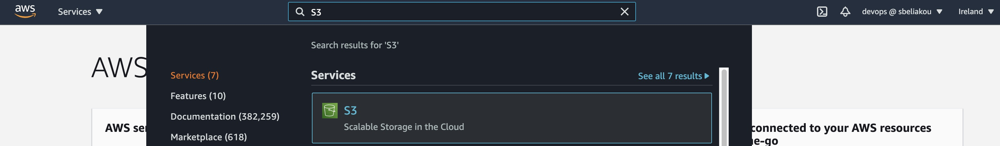
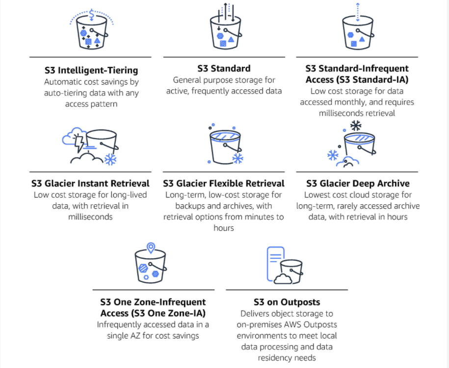
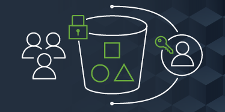
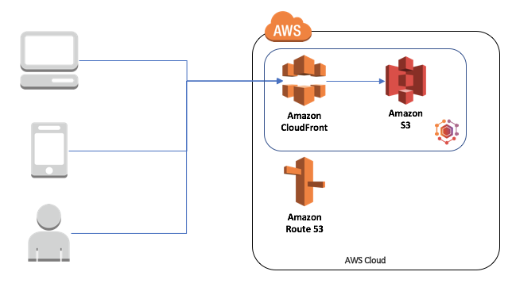
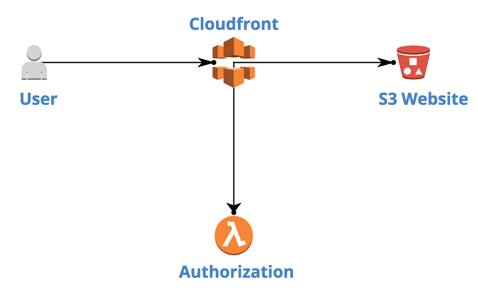
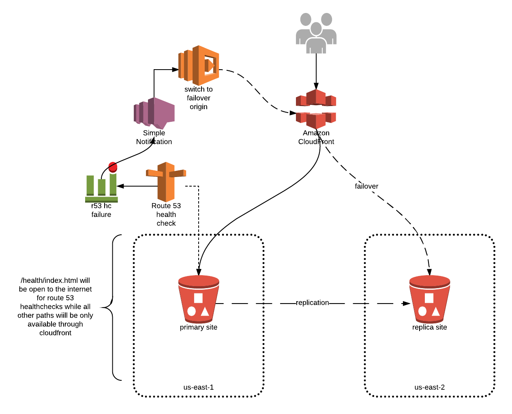

[<< Back to root module](../01-Theory.md)

## Simple Storage Service (S3)

### Table of Content

- [S3 Concepts](#s3-concepts)
- [S3 features](#s3-features)
- [Common Use cases](#common-use-cases)
- [Examples](#examples)
- [Governance](#governance)
- [Pricing considerations](#pricing-considerations)
- [More details](#more-details)

 

**Amazon Simple Storage Service**, widely known as **Amazon S3**, is a highly scalable, fast, and durable solution for object-level storage of any data type. Unlike the operating systems we are all used to, Amazon S3 does not store files in a file system, instead it stores files as objects. Object Storage allows users to upload files, videos, and documents like you were to upload files, videos, and documents to popular cloud storage products like Dropbox and Google Drive. This makes Amazon S3 very flexible and platform agnostic.

 

### How Amazon S3 works

Amazon S3 works as an object storage service. This is different from your typical file storage or even block storage. When a user uploads data to S3, that file is stored as an object with metadata intact and the object as a whole is given an ID.

There are two different kinds of metadata. **System-Defined** and **User-Defined Metadata**. System metadata is used for S3 to maintain important things such as creation date, size, and last-modified.

Objects also take in user-defined metadata. User-defined metadata allows users to assign key-value pairs to the data they upload. These key-value pairs help users identify, organize and assign objects to specific resources, or allow for easy retrieval.

### S3 SLA

Some major advantages of using Amazon S3 include durability, security, and reliability. Per Amazon’s documentation, Amazon S3 provides customers with a `99.999999999%` rate of durability.

How does Amazon achieve this level of durability? AWS S3 redundantly stores your data across multiple devices spanning at least three AZs (Availability Zones) in an S3 Region.

## S3 Concepts

#### Buckets

A **Bucket** is the fundamental container for objects stored in Amazon S3. Drawing parallels with the traditional filesystems, Amazon S3 allows to store objects (files) in “buckets” (directories).

Some facts about Buckets:
- Buckets must have a globally unique name
- Buckets are defined at the region level

Buckets serve several purposes:
- They organize the Amazon S3 namespace at the highest level
- They identify the account responsible for storage and data transfer charges
- They play a role in access control
- They serve as the unit of aggregation for usage reporting

For more information about buckets, see [Buckets overview](https://docs.aws.amazon.com/AmazonS3/latest/userguide/UsingBucket.html).

To understand how to work with buckets, see [Creating, configuring, and working with Amazon S3 buckets](https://docs.aws.amazon.com/AmazonS3/latest/userguide/creating-buckets-s3.html).

#### Objects

An **object** is uniquely identified within a bucket by a key (name) and a version ID.

An object consists of the following:  
- Key
- Version ID
- Value
- Some Metadata
- Subresources
- Access Control Information

For more information about objects and working with it, see [Uploading, downloading, and working with objects in Amazon S3](https://docs.aws.amazon.com/AmazonS3/latest/userguide/uploading-downloading-objects.html).

#### Regions

Buckets tied to the regions.  

You can choose the geographical AWS Region where Amazon S3 will store the buckets that you create. You might choose a Region to optimize latency, minimize costs, or address regulatory requirements. Objects stored in a Region never leave the Region unless you explicitly transfer them to another Region. For example, objects stored in the Europe (Ireland) Region never leave it.  

For more information, see [Regions and Endpoints](https://docs.aws.amazon.com/general/latest/gr/rande.html#s3_region).

## S3 features

#### Storage Classes

Each object in Amazon S3 has a storage class associated with it.  

For example, if you list the objects in an S3 bucket, the console shows the storage class for all the objects in the list.  

Amazon S3 offers a range of storage classes for the objects that you store. You choose a class depending on your use case scenario and performance access requirements. All of these storage classes offer high durability.  

The main S3 storage classes include (but are not limited to) the following:
- S3 Standard for general-purpose storage of frequently accessed data
- S3 Standard_IA for long-lived, but less frequently accessed data
- S3 Glacier for long-term archive  

For a quick comparison of Storage Classes table, see [Comparing the Amazon S3 storage classes](https://docs.aws.amazon.com/AmazonS3/latest/userguide/storage-class-intro.html#sc-compare).

For more information about Storage Classes, choosing the right storage class for you data and using it, see [Using Amazon S3 storage classes](https://docs.aws.amazon.com/AmazonS3/latest/userguide/storage-class-intro.html).

### S3 Object Lock

- Store objects using a write-once-read-many (WORM) model to help you prevent objects from being deleted or overwritten for a fixed amount of time or indefinitely

- Object Lock provides two ways to manage object retention: 

  **Retention period** — Specifies a fixed period of time during which an object remains locked. During this period, your object is WORM-protected and can't be overwritten or deleted. For more information, see 
  [Retention periods](https://docs.aws.amazon.com/AmazonS3/latest/userguide/object-lock-overview.html#object-lock-retention-periods)

  **Legal hold** — Provides the same protection as a retention period, but it has no expiration date. Instead, a legal hold remains in place until you explicitly remove it. Legal holds are independent from retention periods. For more information, see [Legal holds](https://docs.aws.amazon.com/AmazonS3/latest/userguide/object-lock-overview.html#object-lock-legal-holds).

- Object Lock works only in versioned buckets, and retention periods and legal holds apply to individual object versions. When you lock an object version, Amazon S3 stores the lock information in the metadata for that object version. Placing a retention period or legal hold on an object protects only the version specified in the request. It doesn't prevent new versions of the object from being created.

- To use S3 Object Lock, you follow these basic steps:
1. Create a new bucket with Object Lock enabled.
2. (Optional) Configure a default retention period for objects placed in the bucket.
3. Place the objects that you want to lock in the bucket.
4. Apply a retention period, a legal hold, or both, to the objects that you want to protect.

- *For information about configuring and managing S3 Object Lock, see the following sections:*

1. [How S3 Object Lock works](https://docs.aws.amazon.com/AmazonS3/latest/userguide/object-lock-overview.html).
2. [Configuring S3 Object Lock using the console](https://docs.aws.amazon.com/AmazonS3/latest/userguide/object-lock-console.html).
3. [Managing Object Lock](https://docs.aws.amazon.com/AmazonS3/latest/userguide/object-lock-managing.html).

### S3 Glacier Vault Lock

S3 Glacier Vault Lock allows you to easily deploy and enforce compliance controls for individual S3 Glacier vaults with a vault lock policy. You can specify controls such as “write once read many” (WORM) in a vault lock policy and lock the policy from future edits. Once locked, the policy can no longer be changed.

Maint points:

- Enforce compliance controls on each individual Glacier vault with a Vault Lock Policy
- Specify WORM with Vault Lock Policy, and lock the policy from future edits
- 24 hours to validate Vault Lock Policy, before completing the Vault Lock process
- Once locked, the Vault Lock Policy can no longer be changed

Locking a vault takes two steps:
1. Initiate the lock by attaching a vault lock policy to your vault, which sets the lock to an in-progress state and returns a lock ID. While in the in-progress state, you have 24 hours to validate your vault lock policy before the lock ID expires. To prevent your vault from exiting the in-progress state, you must complete the vault lock process within these 24 hours. Otherwise, your vault lock policy will be removed.
2. Use the lock ID to complete the lock process. If the vault lock policy doesn't work as expected, you can stop the lock and restart from the beginning. For information on how to use the S3 Glacier API to lock a vault, see [Locking a Vault by Using the Amazon S3 Glacier API](https://docs.aws.amazon.com/amazonglacier/latest/dev/vault-lock-how-to-api.html).

#### S3 Security

Security is a shared responsibility between AWS and you. The [shared responsibility model](https://aws.amazon.com/compliance/shared-responsibility-model/) describes this as security of the cloud and security in the cloud.

Security in AWS S3 is provided at different levels. S3 Bucket security can be:

**User based:**
- IAM policies; controls which API calls should be allowed for a specific user from IAM console

**Resource Based:**
- Bucket Policies is bucket-wide rules from the S3 console (it also allows cross account access)
- Object Access Control List (ACL) provides finer grain control
- Bucket ACL – less common

To go straight to the S3 security tips and best practices, visit the following section of the Amazon documentation: [Security Best Practices for Amazon S3](https://docs.aws.amazon.com/AmazonS3/latest/userguide/security-best-practices.html).

#### AWS Identity and Access Management  

You can use AWS Identity and Access Management (IAM) to manage access to your Amazon S3 resources.

For example, you can use IAM with Amazon S3 to control the type of access a user or group of users has to specific parts of an Amazon S3 bucket your AWS account owns.  

For more information about IAM, see the following:
- [AWS Identity and Access Management (IAM)](https://aws.amazon.com/iam/)
- [Getting started with IAM](https://docs.aws.amazon.com/IAM/latest/UserGuide/getting-started.html)

#### Bucket policies

Using S3 bucket policy may help to:
- Grant public access to the bucket
- Force objects to be encrypted at upload
- Grant access to another account (Cross Account)

For more information about Bucket policies and its usage, see [Bucket policies and user policies](https://docs.aws.amazon.com/AmazonS3/latest/userguide/using-iam-policies.html).

#### Access control lists

You can control access to each of your buckets and objects using an access control list (ACL).  

For more information, see [Access control list (ACL) overview](https://docs.aws.amazon.com/AmazonS3/latest/userguide/acl-overview.html).

### Common Use cases:

The AWS Solutions site lists many of the ways you can use Amazon S3. The following list summarizes some of those ways:
- Backup and storage – Provide data backup and storage services for others
- Application hosting – Provide services that deploy, install, and manage web applications
- Media hosting – Build a redundant, scalable, and highly available infrastructure that hosts video, photo, or music uploads and downloads
- Software delivery – Host your software applications that customers can download

## Examples:

## Governance

Monitoring is an important part of maintaining the reliability, availability and performance of Amazon S3 and your AWS solutions. For information about monitoring Amazon S3, see [Monitoring Amazon S3](https://docs.aws.amazon.com/AmazonS3/latest/userguide/monitoring-overview.html).

You can use analytics and insights in Amazon S3 to understand, analyze and optimize your storage usage. For information about analytics and insights for Amazon S3, see [Using analytics and insights](https://docs.aws.amazon.com/AmazonS3/latest/userguide/analytics-insights.html).

## Pricing considerations

For information about Amazon S3 prices, see [Amazon S3 pricing](https://aws.amazon.com/s3/pricing/?nc=sn&loc=4)

## More details

### Videos
* [An AWS S3 Tutorial For Beginners](https://www.youtube.com/watch?v=XGcoeEyt2UM)
* [Introduction to S3](https://www.youtube.com/watch?v=_I14_sXHO8U)
* [An S3 tutorial for beginners](https://www.youtube.com/watch?v=XGcoeEyt2UM)

### Documentation
* [Amazon Simple Storage Service Documentation](https://docs.aws.amazon.com/s3/index.html)
* [Getting started with S3](https://docs.aws.amazon.com/AmazonS3/latest/userguide/GetStartedWithS3.html)
* [S3 FAQs](https://aws.amazon.com/s3/faqs/)
* [Amazon S3 Storage Classes](https://aws.amazon.com/s3/storage-classes/)
* [S3 Object lifecycle management](https://docs.aws.amazon.com/AmazonS3/latest/userguide/object-lifecycle-mgmt.html)
* [S3 Protecting data using encryption](https://docs.aws.amazon.com/AmazonS3/latest/userguide/UsingEncryption.html)

[<< Back to root module](../01-Theory.md)
