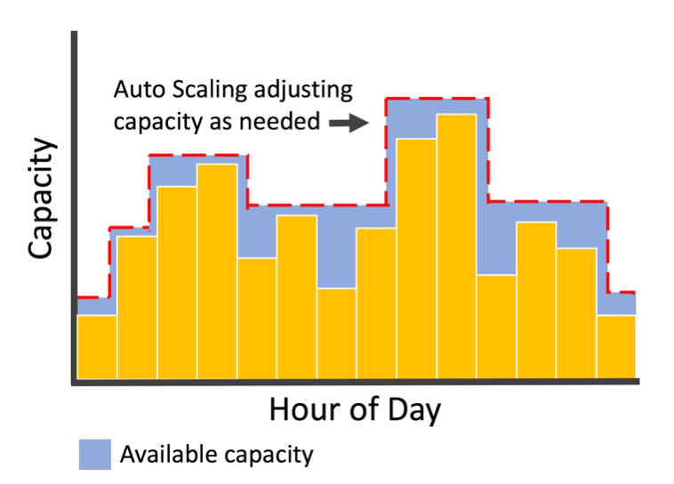

# AWS Compute Services

## Table of Content:

- [Your Goals](#your-goals)
- [Elastic Compute Cloud - EC2](#elastic-compute-cloud---ec2)
- [EC2 Auto Scaling](#ec2-auto-scaling)
- [Load Balancing](#load-balancing)
- [Self-check](#self-check)
- [Hands-on Labs](#hands-on-labs)
- [More details](#more-details)

## Your Goals:

On a high level:

- Be able to name and briefly explain all AWS Compute services
- Be able to tell how AWS provides security for Compute services (data-at-rest and data-in-transit)
- Be able to explain how AWS charges Compute services
- Know base monitoring for Compute Services (which metrics provided\not provided by default in CloudWatch)
- Capabilities of Enhanced Monitoring for Compute Services
- Differentiate Spot, On-demand and Reserved Instances
- Know the difference between Elastic IP and Public IP
- Get familiar with Public FQDN, Private FQDN naming convention
- Know what Bastion and Jump servers are

In details:

- Be familiar with EC2 instances, their types, AMI, Root Volumes, Snapshots, Burstable Instances, CPU Credits
- Understand Instance Metadata, User Data, cloud-init and how to troubleshoot it
- Explain the purpose of usage, base configuration and benefits of Autoscaling, ASG, Launch Templates
- Be familiar with Load Balancer types, target groups, listeners, listener rules and different types of rule actions and rule conditions
- Be able to choose LB for TLS termination, UDP - traffic, routing, originating source IP. Know on what OSI level each type of LB works
- Explain what all EC2 Launch Wizard options mean

##  Elastic Compute Cloud - EC2

### Service Description:

**Amazon Elastic Compute Cloud (Amazon EC2)** provides scalable computing capacity in the Amazon Web Services (AWS) Cloud. Using Amazon EC2 eliminates your need to invest in hardware up front, so you can develop and deploy applications faster. You can use Amazon EC2 to launch as many or as few **virtual servers** as you need, configure security and networking, and manage storage. Amazon EC2 enables you to scale up or down to handle changes in requirements or spikes in popularity, reducing your need to forecast traffic.

For more information, see [EC2](modules/EC2.md).

## EC2 Auto Scaling

### Service description:  

Amazon EC2 Auto Scaling helps you ensure that you have the correct number of Amazon EC2 instances available to handle the load for your application. You create collections of EC2 instances, called Auto Scaling groups. You can specify the minimum number of instances in each Auto Scaling group, and Amazon EC2 Auto Scaling ensures that your group never goes below this size. You can specify the maximum number of instances in each Auto Scaling group, and Amazon EC2 Auto Scaling ensures that your group never goes above this size. If you specify the desired capacity, either when you create the group or at any time thereafter, Amazon EC2 Auto Scaling ensures that your group has this many instances. If you specify scaling policies, then Amazon EC2 Auto Scaling can launch or terminate instances as demand on your application increases or decreases.

For more information, see [EC2 Auto Scaling](modules/AutoScaling.md).

## Load Balancing

### Service Description:

A load balancer serves as the single point of contact for clients. The load balancer distributes incoming application traffic across multiple targets, such as EC2 instances, in multiple Availability Zones. This increases the availability and fault tolerance of your application. Elastic Load Balancing detects unhealthy instances and routes traffic only to healthy targets.

For more information, see [EC2 Load Balancing](modules/LoadBalancing.md).

## Self-check:
- What is EC2?
- What are the types of EC2 instances?
- What provisioning/billing options are available with EC2?
- How to reduce costs when purchasing EC2 instances?
- What are Regions and Availability zones, and how can it help to build high availability solutions?
- What keys are created for each EC2 instance? What for?
- What happens to EC2 instances when they are stopped and started vs re-started?
- What is the difference between IAM roles and EC2 (VPC) security groups?
- What is AMI? How it differs from Snapshot(or from Launch Template)?
- What is EBS? What types of volumes are offered by EC2?
- Is it possible to decrease the size of an existing EBS volume?
- Is it possible to reuse a EBS volume for multiple instances?
- How can you monitor EC2 instances?
- What is horizontal scalability and Amazon EC2 auto scaling?
- What is Load Balancer? What types of Amazon Load Balancers do you know? What is the key difference between them?
- What is the request routing algorithm for Application and Network Load Balancers?
- What is a Listener and Listener rules? What is rule priority and rule condition?
- What is a Target Group? Can you use Lambda behind the Target Group?
- How is it possible to install/configure software on a EC2 instance?
- How is it possible to get such metadata as current region/AZ from within a running EC2 instance?
- What are the key events in EC2 instance lifecycle?
- How is it possible to grant a EC2 instance permissions to access certain AWS resources like S3?

## Hands-on Labs:
[Get the hands-on experience with basic and advanced labs](02-hands-on-labs.md)

## More details

### Videos:

- [Introduction to Amazon EC2](https://www.youtube.com/watch?v=KpVNEzpvaY0)
- [AWS re:Invent 2020: Selecting the right Amazon EC2 instance for your workloads](https://www.youtube.com/watch?v=q5Dn9gcmpJg)
- [How to setup EC2 Auto Scaling with AWS](https://www.youtube.com/watch?v=aVE0w40obKM)
- [AWS re:Invent 2020: Elastic Load Balancing: A year of innovations](https://youtu.be/cntxaahxtfM)
- [AWS re:Invent 2021 - What’s new in Amazon EC2](https://www.youtube.com/watch?v=LHHG5rcPXvw)
- [EC2 Monitoring Overview (Video)](https://www.youtube.com/watch?v=Z0agxlUrwxI)
- [EC2 Monitoring using CloudWatch Agent (Video)](https://www.youtube.com/watch?v=vAnIhIwE5hY)

### Documentation:

- [EC2 News](https://aws.amazon.com/ec2/?ec2-whats-new.sort-by=item.additionalFields.postDateTime&ec2-whats-new.sort-order=desc)
- [Monitor your Application Load Balancers](https://docs.aws.amazon.com/elasticloadbalancing/latest/application/load-balancer-monitoring.html)
- [Troubleshoot your Application Load Balancers](https://docs.aws.amazon.com/elasticloadbalancing/latest/application/load-balancer-troubleshooting.html)
- [EC2 CloudWatch Metrics](https://docs.aws.amazon.com/AWSEC2/latest/UserGuide/viewing_metrics_with_cloudwatch.html#ec2-cloudwatch-metrics)
- [EC2 Monitoring](https://docs.aws.amazon.com/AWSEC2/latest/UserGuide/monitoring_ec2.html)
- [Monitoring Best Practices](https://docs.aws.amazon.com/AWSEC2/latest/UserGuide/monitoring_best_practices.html)
- [EC2 CloudWatch Dimensions](https://docs.aws.amazon.com/AWSEC2/latest/UserGuide/viewing_metrics_with_cloudwatch.html#ec2-cloudwatch-dimensions)

### Recommended Trainings:

## Optional: [Materials for AWS Certification Exam](03-certification_compute.md)
