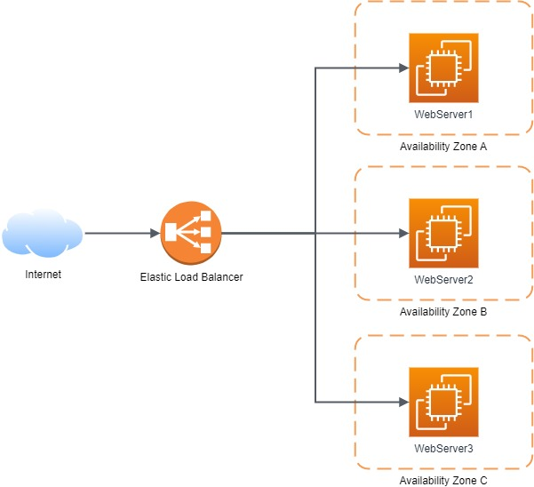

## What’s given
- Your AWS account. 
- S3 bucket with the static website from [The practical task of Module 3: Storage](../03-Storage/04-Practical.md).
- S3 readonly IAM role from [The practical task of Module 2: IAM](../02-IAM/05-Practice.md).

## What to save money on

- Make sure to remove the EC2 instances manually created throughout the sub-tasks 1-2.
- Remove the EBS volume created in the sub-task 3.
- Configure the auto-scaling group to scale between 0-1 instances.
  Also make sure to set the desired instance count to 0 while you’re not working with EC2.
  
## What to do

### Sub-task 1 – Allocate EC2 resources

1. Create a Linux-based EC2 instance (choose any free-tier eligible AMI)
2. Configure a security group for the EC2 instance so that:
   - it allows access over HTTP/HTTPS from anywhere
   - it allows SSH connections from your IP address only
   - optional task – write a script which would update the security group based on your current IP address (comes in handy when you don’t have a static IP address)  
      **_A script example for Windows:_**
      ```
      rem .\task-3-auth-win.bat <your-profile-name> <security-group-id> <region>
      
      for /f %%a in ('powershell Invoke-RestMethod api.ipify.org') do set PublicIP=%%a
      
      aws ec2 authorize-security-group-ingress --group-id %2 --protocol tcp --port 22 --cidr %PublicIP%/32 --profile %1 --region %3
      ```
     
      **_A script example for Unix:_**
      ```
      #!/usr/bin/env bash
      # sh .\task-3-auth-unix.sh <your-profile-name> <security-group-id> <region>
      profile=$1
      groupId=$2
      region=$3
      ipAddress=$(dig @resolver1.opendns.com ANY myip.opendns.com +short) 
      aws ec2 authorize-security-group-ingress --group-id $groupId --protocol tcp --port 22 --cidr $ipAddress/32 --profile $profile --region $region
      ```
   - **known pitfall** – Windows Firewall might block connections by default
3. Make sure an HTTP server(any) is installed and running on the instance. Make sure that it starts whenever the instance boots/reboots.
4. Download the static website created in module 3 on the instance.
5. Make sure you can view the website by accessing your EC2 instance over HTTP.

### Sub-task 2 – Automate EC2 configuration

1. Create a new EC2 instance based on any free-tier Linux AMI and assign the S3 readonly IAM role from module 2 to this instance.
2. Configure the new EC2 instance so that it does the following steps automatically upon startup (tip – use cloud init directives and user data):
   - install HTTP server
   - download the static website created in module 3 from S3
3. Ensure that you can access the static website on the EC2 instance over HTTP.
4. Create a custom AMI based on the EC2 instance.
5. Delete the EC2 instance and create another one based on the custom AMI.
6. Make sure the website is still accessible over HTTP.

### Sub-task 3 – Create and work with an EBS volume

1. Create an EBS volume and attach it to the EC2 instance from the first sub-task.
2. Write any file to the newly created volume and detach the volume from the instance.
3. Attach the volume to the instance from the second sub-task and make sure the file is visible and accessible.

### Sub-task 4 – Create a load-balanced application

1. Create a simple project using your preferred language/framework/build tool. Feel free to customize it as you wish, but keep it simple and remember about the following points:
   - any code must be hosted on GitLab or GitHub.
     We strongly recommend using either GitHub or GitLab as your source providers.
     This is because our CI/CD module requires your repository to be hosted on one of these platforms.
   - creation of deployable artifacts must be automated
   - there will be just one artifact for now – a very simple web-application (the details are below)
   - throughout the subsequent modules, you will have to produce another artifact which will share some code with the web application
   - so you can use something like a multi-module project in Gradle for Java or a multi-package project for Python/NodeJS
2. In your project, create a simple web application with one endpoint (UI page, REST API endpoint, or else) which would return the name of the region and AZ the application is running in (use [this API](https://docs.aws.amazon.com/AWSJavaSDK/latest/javadoc/com/amazonaws/util/EC2MetadataUtils.html)).
3. Build your application and upload the resulting artifact (JAR, ZIP, TAR, or else) to S3.
4. Create another custom AMI based on the one created in the sub-task 2:
   - install a runtime for your web application (Tomcat for Spring MVC, or JVM for Spring Boot, or NodeJS, or Python packages, or else)
   - remove the HTTP server in case your runtime of choice already provides an HTTP server
   - download and deploy your web application artifact from S3
5. Create an auto-scaling group which scales between 2-3 instances running the custom AMI. Scale out when CPU usage is more than 50%.
6. Attach an elastic load balancer to the auto-scaling group.

In the end, the architecture that you're going to create will look similar to this:



## What should I remember?

> - Once you create AWS Account -> Setup Multi-factor Authentication
> - Do NOT share your account
> - Do NOT commit your account Credentials into the Git
> - Terminate/Remove all created resources/services once you finishe Module
> - Please Do not forget to delete NAT Gateway if you used it.
> - Do NOT keep instance running if you don’t use it
> - Carefully keep track of billing and working instances so you don't exceed limits
