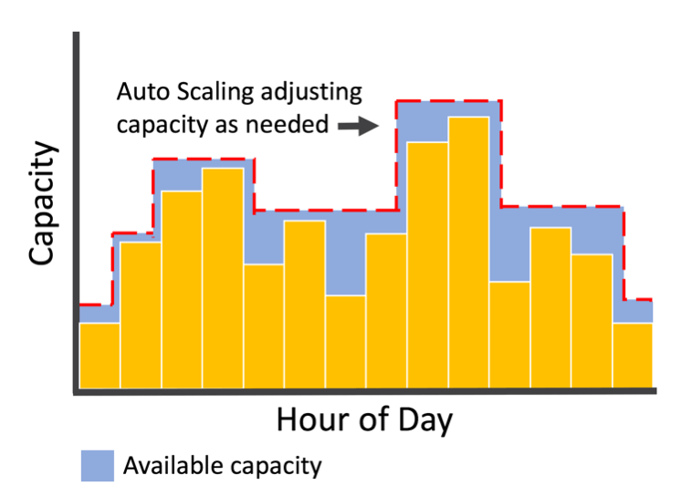
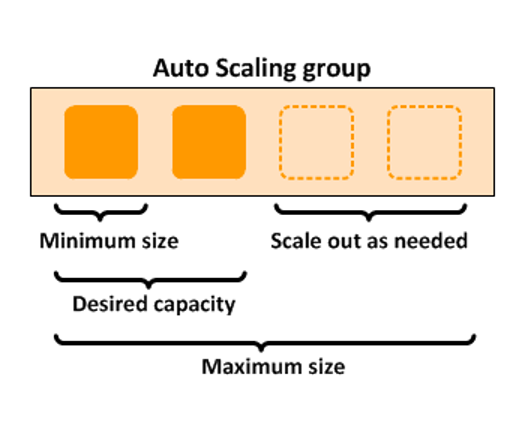
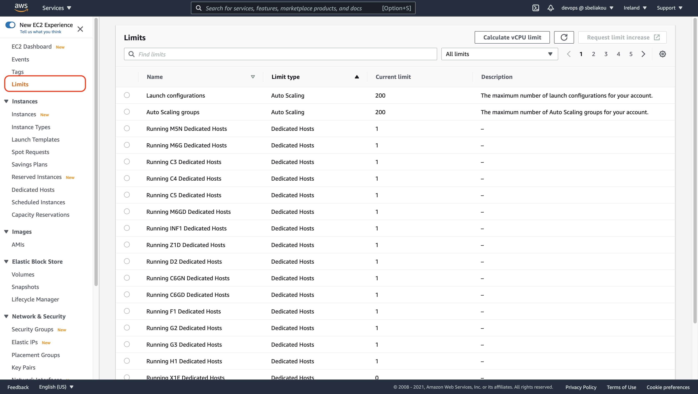

[<< Back to root module](../01-Theory.md)

# EC2 Auto Scaling

## Table of Content:

- [Service description](#service-description)
- [Best practices for AWS Auto Scaling](#best-practices-for-aws-auto-scaling-scaling-plans)
- [Use cases](#use-cases)
- [Limits](#limits)

## Service description:

Amazon EC2 Auto Scaling helps you ensure that you have the correct number of Amazon EC2 instances available to handle the load for your application. You create collections of EC2 instances, called Auto Scaling groups. You can specify the minimum number of instances in each Auto Scaling group, and Amazon EC2 Auto Scaling ensures that your group never goes below this size. You can specify the maximum number of instances in each Auto Scaling group, and Amazon EC2 Auto Scaling ensures that your group never goes above this size. If you specify the desired capacity, either when you create the group or at any time thereafter, Amazon EC2 Auto Scaling ensures that your group has this many instances. If you specify scaling policies, then Amazon EC2 Auto Scaling can launch or terminate instances as demand on your application increases or decreases.

For example, the following Auto Scaling group has a minimum size of one instance, a desired capacity of two instances, and a maximum size of four instances. The scaling policies that you define adjust the number of instances, within your minimum and maximum number of instances, based on the criteria that you specify.

## Best practices for AWS Auto Scaling scaling plans
- [The following best practices can help you make the most of scaling plans](https://docs.aws.amazon.com/autoscaling/plans/userguide/gs-best-practices.html)

## Use cases:

You should use EC2 Auto Scaling if you only need to scale Amazon EC2 Auto Scaling groups, or if you are only interested in maintaining the health of your EC2 fleet. You should also use EC2 Auto Scaling if you need to create or configure Amazon EC2 Auto Scaling groups, or if you need to set up scheduled or step scaling policies (as AWS Auto Scaling supports only target tracking scaling policies).

Adding Amazon EC2 Auto Scaling to your application architecture is one way to maximize the benefits of the AWS Cloud. When you use Amazon EC2 Auto Scaling, your applications gain the following benefits:

- Better fault tolerance. Amazon EC2 Auto Scaling can detect when an instance is unhealthy, terminate it, and launch an instance to replace it. You can also configure Amazon EC2 Auto Scaling to use multiple Availability Zones. If one Availability Zone becomes unavailable, Amazon EC2 Auto Scaling can launch instances in another one to compensate.
- Better availability. Amazon EC2 Auto Scaling helps ensure that your application always has the right amount of capacity to handle the current traffic demand.
- Better cost management. Amazon EC2 Auto Scaling can dynamically increase and decrease capacity as needed. Because you pay for the EC2 instances you use, you save money by launching instances when they are needed and terminating them when they aren't.

## Limits:

Your AWS account has the default quotas, for Amazon EC2 Auto Scaling Groups, Scaling policy quotas and API-specific limits

To view the current quotas for your account, open the Amazon EC2 console at https://console.aws.amazon.com/ec2/ and navigate to the Limits page. You can also use the describe-account-limits command. To request an increase, use the Auto Scaling Limits form.

### Pricing considerations

- [Amazon EC2 Auto Scaling pricing](https://aws.amazon.com/ec2/autoscaling/pricing/?did=ap_card&trk=ap_card)

[<< Back to root module](../01-Theory.md)
