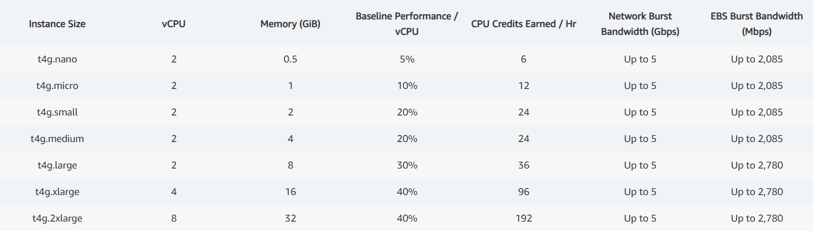
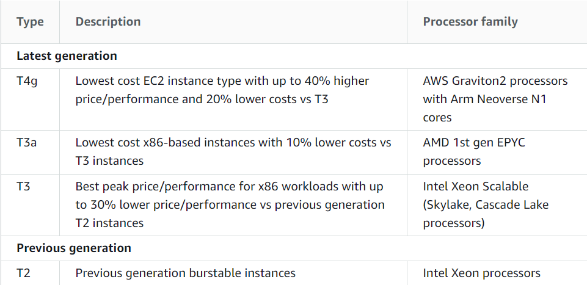
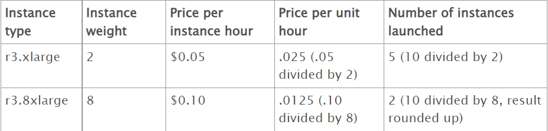

[<< Back to root module](../01-Theory.md)

# Elastic Compute Cloud - EC2

## Table of Content:

- [Service description](#service-description)
- [Key Information about EC2 Service](#key-information-about-ec2-service)
- [Best practices for Amazon EC2](#best-practices-for-amazon-ec2)
- [Regions and Availability Zones](#regions-and-availability-zones)
- [AMIs](#amis)
- [EC2 instance types](#ec2-instance-types)
- [User data and instance metadata](#user-data-and-instance-metadata)
- [EC2 purchasing options](#ec2-purchasing-options)
- [Cautions](#cautions)
- [EC2 Monitoring](#ec2-monitoring)
- [Spot Fleet](#spot-fleet)
- [Useful links](#useful-links)

## Service Description:

**Amazon Elastic Compute Cloud (Amazon EC2)** provides scalable computing capacity in the Amazon Web Services (AWS) Cloud. Using Amazon EC2 eliminates your need to invest in hardware up front, so you can develop and deploy applications faster. You can use Amazon EC2 to launch as many or as few **virtual servers** as you need, configure security and networking, and manage storage. Amazon EC2 enables you to scale up or down to handle changes in requirements or spikes in popularity, reducing your need to forecast traffic.

[More information about Amazon EC2](https://docs.aws.amazon.com/AWSEC2/latest/UserGuide/concepts.html) (read the root article 
and run through the table of contents – you might want to get back to that later)

## Key Information about EC2 Service:

Amazon EC2 provides the following features:
- Virtual computing environments, known as instances
- Preconfigured templates for your instances, known as Amazon Machine Images (AMIs), that package the fits you need for your server (including the operating system and additional software)
- Various configurations of CPU, memory, storage, and networking capacity for your instances, known as instance types
- Secure login information for your instances using key pairs(AWS stores the public key, and you store the private key in a secure place)
- Storage volumes for temporary data that's deleted when you stop, hibernate, or terminate your instance, known as instance store volumes
- Persistent storage volumes for your data using Amazon Elastic Block Store (Amazon EBS), known as Amazon EBS volumes
- Multiple physical locations for your resources, such as instances and Amazon EBS volumes, known as Regions and Availability Zones
- A firewall that enables you to specify the protocols, ports, and source IP ranges that can reach your instances using security groups
- Static IPv4 addresses for dynamic cloud computing, known as **Elastic IP addresses**
- Metadata (including tags), that you can create and assign to your Amazon EC2 resources
- Virtual networks you can create that are logically isolated from the rest of the AWS Cloud, and that you can optionally connect to your own network, known as virtual private clouds(VPCs)

## Best practices for Amazon EC2

- [This list of practices will help you get the maximum benefit from Amazon EC2](https://docs.aws.amazon.com/AWSEC2/latest/UserGuide/ec2-best-practices.html)

## Regions and Availability Zones:

AWS has the concept of a **Regions**, which are a separate geographic areas of the world where we cluster data centers. 
Each group of physical data centers is called an **Availability Zone**. 
Each AWS Region consists of multiple, isolated, and physically separate AZs. 
Unlike other cloud providers, who often define a region as a single data center, the multiple AZ design of every AWS Region offers advantages for customers. Each AZ has independent power, cooling, and physical security and is connected via redundant, ultra-low-latency networks. AWS customers focused on high availability can design their applications to run in multiple AZs to achieve even greater fault-tolerance. AWS infrastructure Regions meet the highest levels of security, compliance, and data protection.

[More information about Regions and Availability Zones (AZ)](https://docs.aws.amazon.com/AWSEC2/latest/UserGuide/using-regions-availability-zones.html)

## AMIs

> An Amazon Machine Image (AMI) provides the information required to launch an instance. You must specify an AMI when you launch an instance. You can launch multiple instances from a single AMI when you need multiple instances with the same configuration. You can use different AMIs to launch instances when you need instances with different configurations.

An AMI includes: one or more Amazon EBS snapshots,  launch permissions that control which AWS accounts can use the AMI to launch instances and a block device mapping that specifies the volumes to attach to the instance when it's launched.

After you launch an instance from an AMI, you can connect to it. When you are connected to an instance, you can use it just like you use any other server. For information about launching, connecting, and using your instance, see Tutorial: [Get started with Amazon EC2 Linux instances](https://docs.aws.amazon.com/AWSEC2/latest/UserGuide/EC2_GetStarted.html).

[AMI Lifecycle](https://docs.aws.amazon.com/AWSEC2/latest/UserGuide/ami-lifecycle.html)

The following diagram summarizes the AMI lifecycle. After you create and register an AMI, you can use it to launch new instances. (You can also launch instances from an AMI if the AMI owner grants you launch permissions.) When you no longer require an AMI, you can deregister it.

You can search for an AMI that meets the criteria for your instance. You can search for AMIs provided by AWS or AMIs provided by the community. For more information, see [AMI types](https://docs.aws.amazon.com/AWSEC2/latest/UserGuide/ComponentsAMIs.html) and Find a [Linux AMI](https://docs.aws.amazon.com/AWSEC2/latest/UserGuide/finding-an-ami.html).

[Create your own AMIs](https://docs.aws.amazon.com/AWSEC2/latest/UserGuide/AMIs.html#creating-an-ami)

You can launch an instance from an existing AMI, customize the instance (for example, install software on the instance), and then save this updated configuration as a custom AMI. Instances launched from this new custom AMI include the customizations that you made when you created the AMI. Learn how do you launch an EC2 instance from your own AMI in [tutorial](https://aws.amazon.com/ru/premiumsupport/knowledge-center/launch-instance-custom-ami/)

[Copy an AMI](https://docs.aws.amazon.com/AWSEC2/latest/UserGuide/CopyingAMIs.html)

You can copy an Amazon Machine Image (AMI) within or across AWS Regions. You can copy both Amazon EBS-backed AMIs and instance-store-backed AMIs. You can copy AMIs with encrypted snapshots and also change encryption status during the copy process. You can copy AMIs that are shared with you.

Copying a source AMI results in an identical but distinct target AMI with its own unique identifier. You can change or deregister the source AMI with no effect on the target AMI. The reverse is also true.

## EC2 instance types:
Amazon EC2 provides a wide selection of instance types optimized for different use cases. To determine which instance types meet your requirements, such as supported Regions, compute resources, or storage resources, see [Find an Amazon EC2 instance type.](https://docs.aws.amazon.com/AWSEC2/latest/UserGuide/instance-discovery.html)

There are several types of instances:
- [General purpose instances](https://docs.aws.amazon.com/AWSEC2/latest/UserGuide/general-purpose-instances.html) provide a balance of compute, memory, and networking resources, and can be used for a wide range of workloads. There are a number of general purpose instance types:[See explanation bellow](#general-purpose-instances)
- [Compute optimized instances](https://docs.aws.amazon.com/AWSEC2/latest/UserGuide/compute-optimized-instances.html) are ideal for compute-bound applications that benefit from high-performance processors.
- [Memory optimized instances](https://docs.aws.amazon.com/AWSEC2/latest/UserGuide/memory-optimized-instances.html) are designed to deliver fast performance for workloads that process large data sets in memory.
- [Storage optimized instances](https://docs.aws.amazon.com/AWSEC2/latest/UserGuide/storage-optimized-instances.html) are designed for workloads that require high, sequential read and write access to very large data sets on local storage. They are optimized to deliver tens of thousands of low-latency, random I/O operations per second (IOPS) to applications.
- [Accelerated computing instances](https://docs.aws.amazon.com/AWSEC2/latest/UserGuide/accelerated-computing-instances.html) use hardware accelerators, or co-processors, to perform functions, such as floating point number calculations, graphics processing, or data pattern matching, more efficiently than is possible in software running on CPUs.

### General purpose instances:
These types support bursting CPU usage at any time and as long as you need. Each generation has some unique features. Instances are a low-cost. T-type instances is available on the AWS Free tier(availible generation depends on region).
T4g instances are powered by Arm-based AWS Graviton2 processors.
These instances are ideal for:
* Websites and web applications
* Code repositories
* Development, build, test, and staging environments
* Microservices

[M-type](https://aws.amazon.com/ec2/instance-types/m5/),
[T-type](https://aws.amazon.com/ec2/instance-types/t2/),
[Mac1 instance](https://docs.aws.amazon.com/AWSEC2/latest/UserGuide/ec2-mac-instances.html)

Figure: T4 instance type specifications

### Burstable performance instances:
The T instance family provides a baseline CPU performance with the ability to burst above the baseline at any time for as long as required.
The T instances offer a balance of compute, memory, and network resources, and provide you with the most cost-effective way to run a broad spectrum of general purpose applications that have a low-to-moderate CPU usage. They can save you up to 15% in costs when compared to M instances, and can lead to even more cost savings with smaller, more economical instance sizes, offering as low as 2 vCPUs and 0.5 GiB of memory.

Differences between the burstable instance types:

## User data and instance metadata:

### [User data](https://docs.aws.amazon.com/AWSEC2/latest/UserGuide/instancedata-add-user-data.html)

AWS user data is the set of commands/data you can provide to a instance at launch time.

When you launch an instance in Amazon EC2, you have the option of passing user data to the instance that can be used to perform common automated configuration tasks and even run scripts after the instance starts. You can pass two types of user data to Amazon EC2: [shell scripts](https://docs.aws.amazon.com/AWSEC2/latest/UserGuide/user-data.html#user-data-shell-scripts) and [cloud-init directives](https://docs.aws.amazon.com/AWSEC2/latest/UserGuide/user-data.html#user-data-cloud-init). You can also pass this data into the launch wizard as plain text, as a file (this is useful for launching instances using the command line tools), or as base64-encoded text (for API calls).
For more information, see [Run commands on your Linux instance at launch](https://docs.aws.amazon.com/AWSEC2/latest/UserGuide/user-data.html#user-data-requirements)

To retrieve user data from within a running instance, use the following URI: http://169.254.169.254/latest/user-data

### [Сloud-init](https://docs.aws.amazon.com/AWSEC2/latest/UserGuide/amazon-linux-ami-basics.html#amazon-linux-cloud-init)

The cloud-init package is an open-source application built by Canonical that is used to bootstrap Linux images in a cloud computing environment, such as Amazon EC2. Amazon Linux contains a customized version of cloud-init. It enables you to specify actions that should happen to your instance at boot time.

### Ways how to troubleshoot user data scripts:

1. You can verify using the following steps:
   a) SSH on launch EC2 instance.
   b) Check the log of your user data script in:
   /var/log/cloud-init.log and
   /var/log/cloud-init-output.log
   You can see all logs of your user data script, and it will also create the /etc/cloud folder.

2. Right click on your instance, then in the new interface:
   Monitor and Troubleshoot > Get System Log

3. [Amazon linux](https://aws.amazon.com/ru/premiumsupport/knowledge-center/ec2-linux-log-user-data/)

4. [Windows](https://aws.amazon.com/ru/premiumsupport/knowledge-center/ec2-windows-troubleshoot-user-data/)

### [Instance metadata](https://docs.aws.amazon.com/AWSEC2/latest/UserGuide/ec2-instance-metadata.html)

Instance metadata is data about your instance that you can use to configure or manage the running instance. Instance metadata is divided into categories, for example, host name, events, and security groups.

Because your instance metadata is available from your running instance, you do not need to use the Amazon EC2 console or the AWS CLI. This can be helpful when you're writing scripts to run from your instance. For example, you can access the local IP address of your instance from instance metadata to manage a connection to an external application.

To view all categories of instance metadata from within a running instance, use the following IPv4(http://169.254.169.254/latest/meta-data/) or IPv6(http://[fd00:ec2::254]/latest/meta-data/) URIs.

### More details

- [AWS User Guide: Burstable performance instances](https://docs.aws.amazon.com/AWSEC2/latest/UserGuide/burstable-performance-instances.html)
- [VMWare blog: Burstable performance instances](https://blogs.vmware.com/cloudhealth/amazon-burstable-instances-explained)
- [Instance types overview](https://aws.amazon.com/ec2/instance-types/)

## EC2 purchasing options:
Amazon EC2 provides the following purchasing options to enable you to optimize your costs based on your needs ([Amazon EC2 pricing](https://aws.amazon.com/ec2/pricing/?did=ap_card&trk=ap_card)):

- [On-Demand Instances](https://docs.aws.amazon.com/AWSEC2/latest/UserGuide/ec2-on-demand-instances.html) – Pay, by the second, for the instances that you launch.
- [Reserved Instances](https://docs.aws.amazon.com/AWSEC2/latest/UserGuide/ec2-reserved-instances.html) – Reduce your Amazon EC2 costs by making a commitment to a consistent instance configuration, including instance type and Region, for a term of 1 or 3 years.
- [Spot Instances](https://docs.aws.amazon.com/AWSEC2/latest/UserGuide/using-spot-instances.html) – Request unused EC2 instances, which can reduce your Amazon EC2 costs significantly.
- [Dedicated Hosts](https://docs.aws.amazon.com/AWSEC2/latest/UserGuide/dedicated-hosts-overview.html) – Pay for a physical host that is fully dedicated to running your instances, and bring your existing per-socket, per-core, or per-VM software licenses to reduce costs.
- [Dedicated Instances](https://docs.aws.amazon.com/AWSEC2/latest/UserGuide/dedicated-instance.html) – Pay, by the hour, for instances that run on single-tenant hardware.
- [Capacity Reservations](https://docs.aws.amazon.com/AWSEC2/latest/UserGuide/ec2-capacity-reservations.html) – Reserve capacity for your EC2 instances in a specific Availability Zone for any duration.

In additional you can use [Savings Plans](https://docs.aws.amazon.com/savingsplans/latest/userguide/what-is-savings-plans.html) for reducing your Amazon EC2 costs by making a commitment to a consistent amount of usage, in USD per hour, for a term of 1 or 3 years.

## Cautions

Amazon EC2 provides different resources that you can use. These resources include images, instances, volumes, and snapshots. When you create your AWS account, it configured with default quotas (also referred to as limits) on these resources on a per-Region basis.

One of the most important is the limit on the number of running On-Demand Instances per AWS account per Region. On-Demand Instance limits are managed in terms of the number of virtual central processing units (vCPUs, regardless of the instance type).

Please refer to the documentation: [Request a limit increase](https://docs.aws.amazon.com/AWSEC2/latest/UserGuide/ec2-on-demand-instances.html#vcpu-limits-request-increase)

EC2 usage are billed on one second increments, with a minimum of 60 seconds. Similarly, provisioned storage for EBS volumes will be billed per-second increments, with a 60 second minimum. Per-second billing is available for instances launched in:
- On-Demand, Reserved and Spot forms
- All regions and Availability Zones
- Amazon Linux and Ubuntu

For details on related costs like data transfer, Elastic IP addresses, and EBS Optimized Instances, visit https://aws.amazon.com/ec2/pricing/

## EC2 Monitoring:

Monitoring is an important part of maintaining the reliability, availability, and performance of your Amazon Elastic Compute Cloud (Amazon EC2) instances and your AWS solutions. You can monitor the status of your instances by viewing **Status Checks** and scheduled events for your instances. There are two types of status checks.

System status checks:

- Monitor the systems on which your instances run
- Reasons for failure:
  - Loss of network connectivity
  - Loss of system power
  - Software issues on the physical host
  - Hardware issues on the physical host that impact network reachability

Instance status checks:

- Monitor the network and software configuration on an instance
- You must intervene to fix
- Reason for failure:
  - Failed systems status checks
  - Incorrect networking or startup configuration
  - Exhausted memory
  - Corrupted file system
  - Incompatible kernel

Also you can monitor your instances using **Amazon CloudWatch**, which collects and processes raw data from Amazon EC2 into readable, near real-time metrics. These statistics are recorded for a period of 15 months, so that you can access historical information and gain a better perspective on how your web application or service is performing.

You could collect following EC2 metrics:

- CPUUtilization
- DiskReadOps
- DiskWriteOps
- DiskReadBytes
- DiskWriteBytes
- NetworkIn
- NetworkOut
- NetworkPacketsIn
- NetworkPacketsOut
- MetadataNoToken

## Spot Fleet

Amazon Web Services (AWS) Spot Fleets are collections of AWS spot instances and optionally On-Demand Instances, virtual servers from Amazon’s pool of spare capacity, offered at discounts of up to 90%. Spot instances need to be carefully managed, because they are terminated by Amazon at short notice when the market price goes about your bidding price.
Applications can make requests for Spot Fleets via the Spot Fleet application programming interface (API) or the command line interface (CLI). Because spot instances pricing often changes, EC2 constantly attempts to balance the capacity according to predefined values.

AWS Spot instances are an excellent way to significantly reduce your EC2 on demand instance cost by up to 90%.AWS spot instances represent AWS’s excess capacity.

AWS Spot instances can be used for a much broader set of use cases, without any significant impact on availability or performance. Some examples:

* Stateful applications
* Machine Learning
* CI/CD operations
* Big Data
* Distributed DBs such as Elasticsearch, Cassandra, Mongo

There are two types of Spot Fleet requests:

* Request creates a spot fleet on a one-time basis
* Maintain creates a Spot Fleet and maintains a desired capacity on an ongoing basis, identifying and recovering failed instances

[Spot Fleet instance weighting:](https://docs.aws.amazon.com/AWSEC2/latest/UserGuide/spot-instance-weighting.html)

When you request a fleet of Spot Instances, you can define the capacity units that each instance type would contribute to your application's performance, and adjust your maximum price for each Spot capacity pool accordingly using instance weighting.
With spot fleets, you can also apply a custom weighting to each instance type. Weighting tells the spot fleet request what total capacity we care about. As a simple example, say we would like a total capacity of 10GB of RAM, and we select two instance types, one that has 2GB and one that has 4GB of RAM.
If we assign a weight to each instance that is equal to the amount of RAM, then we can tell the spot fleet to give us 10 units of capacity. Spot fleet then uses the weighting information to provision 10 units. It can be five 2GB instances or two 4GB and one 2GB instance. It does not matter. We still get a total of 10 units or 10GB of capacity.
Spot fleets work conservatively and will round up and slightly over provision if the instance types happen not perfectly to meet 10 units. For example, three 4GB instances result in 12 units.

The following tables provide examples of calculations to determine the price per unit for a Spot Fleet request with a target capacity of 10:

### Use cases / Considerations
- __Hosting environments.__ One of the foremost uses of EC2 is for hosting a variety of applications, software and websites on the cloud. Users are even hosting games on the cloud, turning the servers on and off when needed. And the best part of this dynamic and scalable environment is that its compute capacity can grow along with the need of the application. This in turn ensures the best quality service for all end users at all times.
- __Development and test environments.__ The scalable nature of EC2 means that organizations now have the ability to create and deploy large scale testing and development environments with unprecedented ease. The Amazon cloud does away with any heavy upfront investments for hardware, all the while providing as scalable solution.
- __Backup and disaster recovery.__ Companies are leveraging EC2 as a medium for performing disaster recovery for both active and passive environments. The fact that the Amazon Elastic Compute Cloud can be turned up quickly in case of an emergency, means that businesses have access to a faster failover with minimal downtime for their applications.
- __Banking and financial sector.__ These are areas that demand the utmost in security and scalability — both are factors that Amazon EC2 provides in droves. Financial institutions trust the Amazon cloud to provide a range of highly secure services. Retail and commercial banks, credit unions, insurance providers, card service companies, and major payment platforms rely on AWS for their scalable cloud computing needs. 
- __Marketing and advertisement.__ Low costs and rapid provisioning capabilities that EC2 allows have resulted in the platform increasingly being used to host marketing and advertising environments on the fly.
- __High performance computing.__ The need for HPC is exponentially on the rise, and EC2 provides specialized virtualized servers that provide both high performance networking and compute power. These can be used to perform a range of CPU intensive and number crunching tasks, including Big Data analytics and processing.

### More details

- [Spot fleet](https://docs.aws.amazon.com/AWSEC2/latest/UserGuide/spot-fleet.html)

- [Spot instances](https://docs.aws.amazon.com/AWSEC2/latest/UserGuide/using-spot-instances.html)

- [Spot Fleet instance weighting](https://blog.boltops.com/2018/07/16/spot-fleet-weighting-and-pricing-explained/)

- [What is the difference between Spot Fleet vs Spot Instances](https://blog.boltops.com/2018/07/15/what-is-the-difference-between-spot-fleet-vs-spot-instances/)

- [Spot instances pricing](https://aws.amazon.com/ec2/spot/pricing/)

## Useful links

- [Set up to use Amazon EC2](https://docs.aws.amazon.com/AWSEC2/latest/UserGuide/get-set-up-for-amazon-ec2.html)
- [Install a LAMP web server](https://docs.aws.amazon.com/AWSEC2/latest/UserGuide/ec2-lamp-amazon-linux-2.html)
- [Amazon EC2 FAQs](https://aws.amazon.com/ec2/faqs/)
- [How to Use PuTTY on Windows](https://www.ssh.com/academy/ssh/putty/windows)

[<< Back to root module](../01-Theory.md)
