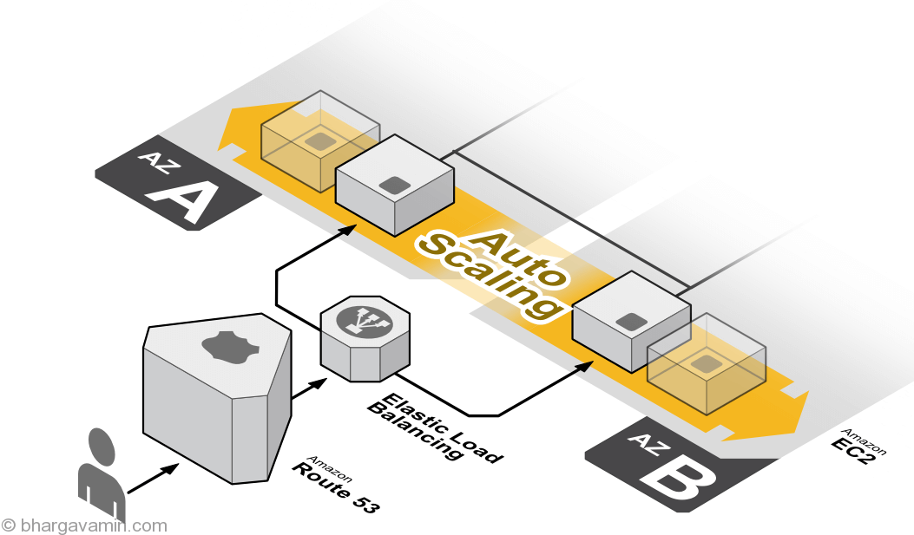

[<< Back to root module](../01-Theory.md)

# EC2 Load Balancing

## Table of Content:

- [Service description](#service-description)
- [Use cases / Considerations](#use-cases--considerations)
- [Governance](#governance)
- [Cautions](#cautions)
- [ELB Monitoring](#elb-monitoring)
- [Pricing considerations](#pricing-considerations)
- [Best practice rules for ELB](#best-practice-rules-for-elb)

## Service Description:

A load balancer serves as the single point of contact for clients. The load balancer distributes incoming application traffic across multiple targets, such as EC2 instances, in multiple Availability Zones. This increases the availability and fault tolerance of your application. Elastic Load Balancing detects unhealthy instances and routes traffic only to healthy targets.

There are 4 types of Load Balancers available to choose:

- An **[Application Load Balancer (ALB)](https://docs.aws.amazon.com/elasticloadbalancing/latest/application/application-load-balancers.html)** functions at the application layer, the seventh layer of the Open Systems Interconnection (OSI) model. After the load balancer receives a request, it evaluates the listener rules in priority order to determine which rule to apply, and then selects a target from the target group for the rule action. You can configure listener rules to route requests to different target groups based on the content of the application traffic. Routing is performed independently for each target group, even when a target is registered with multiple target groups. You can configure the routing algorithm used at the target group level. The default routing algorithm is round robin; alternatively, you can specify the least outstanding requests routing algorithm.

  Detailed ALB components:

    - **Listener**. A listener is a process that checks for connection requests, using the protocol and port you configure. Traffic received by the listener is then routed to targets per your specification. You can specify multiple rules and multiple certificates per listener for ALB. Listeners support the following protocols and ports: *protocols* - HTTP, HTTPS; *ports* - 1-65535. For more information, see [Listeners](https://docs.aws.amazon.com/elasticloadbalancing/latest/application/load-balancer-listeners.html).
    - **Listener rules**. The rules that you define for a listener determine how the load balancer routes requests to its registered targets. Each listener has a default rule, and you can optionally define additional rules. Each rule consists of a priority, one or more actions, and one or more conditions. For more information, see [Listener rules](https://docs.aws.amazon.com/elasticloadbalancing/latest/application/load-balancer-listeners.html#listener-rules).
    - **Target groups**. Each target group is used to route requests to one or more registered targets. When you create each listener rule, you specify a target group and conditions. When a rule condition is met, traffic is forwarded to the corresponding target group. You can create different target groups for different types of requests. For more information, see [Target groups](https://docs.aws.amazon.com/elasticloadbalancing/latest/application/load-balancer-target-groups.html).

 

- A **[Network Load Balancer (NLB)](https://docs.aws.amazon.com/elasticloadbalancing/latest/network/network-load-balancers.html)** functions at the fourth layer of the Open Systems Interconnection (OSI) model. It can handle millions of requests per second. After the load balancer receives a connection request, it selects a target from the target group for the default rule. It attempts to open a TCP connection to the selected target on the port specified in the listener configuration.  
  For TCP traffic, the load balancer selects a target using a flow hash algorithm based on the protocol, source IP address, source port, destination IP address, destination port, and TCP sequence number. The TCP connections from a client have different source ports and sequence numbers, and can be routed to different targets. Each individual TCP connection is routed to a single target for the life of the connection.  
  For UDP traffic, the load balancer selects a target using a flow hash algorithm based on the protocol, source IP address, source port, destination IP address, and destination port. A UDP flow has the same source and destination, so it is consistently routed to a single target throughout its lifetime. Different UDP flows have different source IP addresses and ports, so they can be routed to different targets.

  Detailed NLB components:

    - **Listener**. A listener checks for connection requests from clients, using the protocol and port that you configure, and forwards requests to a target group. Listeners support the following protocols and ports: *protocols* - TCP, TLS, UDP, TCP_UDP; *ports* - 1-65535. For more information, see [Listeners](https://docs.aws.amazon.com/elasticloadbalancing/latest/network/load-balancer-listeners.html).
    - **Listener rules**. The rules that you define for a listener determine how the load balancer routes requests to the targets in one or more target groups. For more information, see [Listener rules](https://docs.aws.amazon.com/elasticloadbalancing/latest/network/load-balancer-listeners.html#listener-rules).
    - **Target groups**. Each target group is used to route requests to one or more registered targets. When you create each listener rule, you specify a target group and conditions. When a rule condition is met, traffic is forwarded to the corresponding target group. You can create different target groups for different types of requests. For more information, see [Target groups](https://docs.aws.amazon.com/elasticloadbalancing/latest/network/load-balancer-target-groups.html).

 

- A **Classic Load Balancer** is a previous generation of loadbalancers. It’s recommended to consider mentioned above types of loadbalancers instead. CLB operates on Layer 4/7 of the Open Systems Interconnection (OSI) model. The only one type of LB which is compatible with EC2-Classic

 

- **Gateway Load Balancers** enable you to deploy, scale, and manage virtual appliances, such as firewalls, intrusion detection and prevention systems, and deep packet inspection systems. It combines a transparent network gateway (that is, a single entry and exit point for all traffic) and distributes traffic while scaling your virtual appliances with the demand.
  A Gateway Load Balancer operates at the third layer of the Open Systems Interconnection (OSI) model, the network layer. It listens for all IP packets across all ports and forwards traffic to the target group that's specified in the listener rule. It maintains stickiness of flows to a specific target appliance using 5-tuple (for TCP/UDP flows) or 3-tuple (for non-TCP/UDP flows).  
  Gateway Load Balancers use Gateway Load Balancer endpoints to securely exchange traffic across VPC boundaries. Traffic to and from a Gateway Load Balancer endpoint is configured using route tables. Traffic flows from the service consumer VPC over the Gateway Load Balancer endpoint to the Gateway Load Balancer in the service provider VPC, and then returns to the service consumer VPC. You must create the Gateway Load Balancer endpoint and the application servers in different subnets. This enables you to configure the Gateway Load Balancer endpoint as the next hop in the route table for the application subnet.
  AWS Demo: [Getting Started with AWS Gateway Load Balancer](https://youtu.be/f4DduW2M5WI)

## Use cases / Considerations
Comparison of different Loadbalancers is gathered in [the provided table](https://aws.amazon.com/elasticloadbalancing/features/#Product_comparisons).
In case of CLB don’t forget to activate [cross-zone loadbalancing](https://docs.aws.amazon.com/elasticloadbalancing/latest/classic/enable-disable-crosszone-lb.html).
ELBs can be Internet facing or internal-only.

### ReIvent videos to make a right decision on LoadBalancer type:
- [AWS re:Invent 2019: Get the most from Elastic Load Balancing for different workloads (NET407-R2)](https://youtu.be/HKh54BkaOK0)
- [AWS re:Invent 2020: Choosing the right load balancer for serverless applications](https://youtu.be/mjabA8aQjks)

## Governance

There are different metrics available for each type of loadbalancer:
- [ALB metrics](https://docs.aws.amazon.com/elasticloadbalancing/latest/application/load-balancer-cloudwatch-metrics.html)
- [CLB metrics](https://docs.aws.amazon.com/elasticloadbalancing/latest/classic/elb-cloudwatch-metrics.html)
- [NLB metrics](https://docs.aws.amazon.com/elasticloadbalancing/latest/network/load-balancer-cloudwatch-metrics.html)
- [GLB metrics](https://docs.aws.amazon.com/elasticloadbalancing/latest/gateway/cloudwatch-metrics.html)

It's highly recommended paying attention to such metric as **Request/Error counts**, **Latency**, **Healthy/Unhealty hosts counts**. For CLB **SurgeQueueLength** and **SpilloverCount**.
Also It worth activating Access Log collection to S3 bucket.

## Cautions

- Please be acquainted with existing quotas per each type of LB - [Application](https://docs.aws.amazon.com/elasticloadbalancing/latest/application/load-balancer-limits.html), [Classic](https://docs.aws.amazon.com/elasticloadbalancing/latest/classic/elb-limits.html), [Network](https://docs.aws.amazon.com/elasticloadbalancing/latest/network/load-balancer-limits.html) and [Gateway](https://docs.aws.amazon.com/elasticloadbalancing/latest/gateway/quotas-limits.html)
- ALB does not support a static IP address but does have a fixed DNS address - you can put an NLB in front of an ALB to get a static IP address
- ALB requires prewarming if you’re experiencing spike in traffic – just raise the ticket to support. Be aware that ALB can consume up to 100 ip addresses in subnets, where it’s placed – keep it mind during network planning phase.
- Whitelist your loadbalancers for targets via SG/NACLs

## ELB Monitoring:

You can use the following features to monitor your load balancers, analyze traffic patterns, and troubleshoot issues with your load balancers and back-end instances.

- **CloudWatch metrics**  
  Elastic Load Balancing publishes data points to Amazon CloudWatch about your load balancers and back-end instances.

- **Elastic Load Balancing access logs**  
  The access logs for Elastic Load Balancing capture detailed information for requests made to your load balancer and stores them as log files in the Amazon S3 bucket that you specify.

- **CloudTrail logs**  
  AWS CloudTrail enables you to keep track of the calls made to the Elastic Load Balancing API by or on behalf of your AWS account. CloudTrail stores the information in log files in the Amazon S3 bucket that you specify.

## Pricing considerations
The pricing is consolidated on common [AWS page](https://aws.amazon.com/elasticloadbalancing/pricing/)

## Best practice rules for ELB

Recommendations for the AWS Elastic Load Balancing:
- https://www.trendmicro.com/cloudoneconformity/knowledge-base/aws/ELB/
- https://www.trendmicro.com/cloudoneconformity/knowledge-base/aws/ELBv2/

[<< Back to root module](../01-Theory.md)
