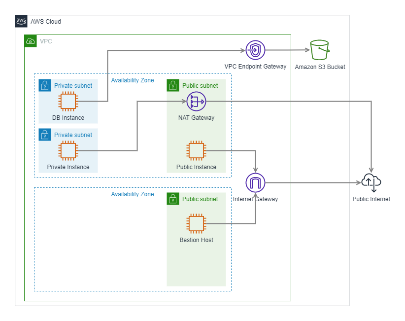

## What’s given
- Your AWS account. 
- The IAM Role from [Module: IAM](../02-IAM/05-Practice.md). 
- The S3 bucket from [Module: S3](../03-Storage/04-Practical.md). 
- The web application from [Module: EC2](../04-EC2/04-Practical.md). 

## What to do
You've already used a VPC during creating EC2 instance, but it was behind the scenes. Basically, every AWS Account has its own default VPC with the whole configuration. Now it's time to create your own VPC. 

The AWS architecture that should be implemented is below: 

### Sub-task 1 – Create a VPC Configuration 

1. Create a VPC: 
   - The name should follow this convention _\<ProjectName\>-Network_. 
   - The CIDR block should be _10.0.0.0/16_.
2. Create an Internet Gateway: 
   - The name is _\<ProjectName\>-IGW_. 
   - Attach it to the _\<ProjectName\>-Network_ VPC. 
3. Create two Public Subnets in the VPC:
   - _\<ProjectName\>-PublicSubnet-A_ in the first AZ with a CIDR block of _10.0.11.0/24_.
   - _\<ProjectName\>-PublicSubnet-B_ in the second AZ with a CIDR block of _10.0.21.0/24_.
   - Make them public and choose _Auto-Assign Public IP_.
4. Create a new Route Table for the Public Subnets: 
   - The name is _\<ProjectName\>-PublicRouteTable_. 
   - Add a _10.0.0.0/16_ – _Local_ route. 
   - Add a _0.0.0.0/0_ - _\<ProjectName\> IGW_ route. **This route is necessary and provides connection to the internet for subnets that are associated with the Route Table.** 
   - Associate the Public Subnets with the new Route Table.
5. Create a Private Subnet in the VPC:
   - _\<ProjectName\>-PrivateSubnet-A_ in the first AZ with a CIDR block of _10.0.12.0/24_.
6. Create a new Route Table for the Private Subnet: 
   - The name is _\<ProjectName\>-PrivateRouteTable-A_. 
   - Add a _10.0.0.0/16_ – _Local_ route. 
   - Associate the Private Subnet with the new Route Table. 
7. Create a DB Subnet in the VPC: 
   - _\<ProjectName\>-DbSubnet-A_ in the first AZ with a CIDR block of _10.0.13.0/24_. 
8. Create a new Route Table for the DB Subnet: 
   - The name is _\<ProjectName\>-DbRouteTable_. 
   - Add a _10.0.0.0/16_ – _Local_ route. 
   - Associate DB subnet with the new Route Table. 
9. Create a NAT Gateway for the Private Subnet: 
   - The NAT Gateway must be placed in the Public Subnet that was created in the first AZ. 
   - The name is _\<ProjectName\>-NatGateway-A_. 
   - Allocate an elastic IP and attach it to the NAT Gateway. 
   - Add a _0.0.0.0/0_ - _\<ProjectName\>-NatGateway-A_ route to the _\<ProjectName\>-PrivateRouteTable-A_ table. **This route will provide access to the internet for resources that are created in the Private Subnet.** 

**NOTE: Be aware about costs for a NAT ~ 1$ per day. Remove if not using right now.**

### Sub-task 2 – Create EC2 Instances in the VPC 

1. Create 3 security groups: 
   - The name is _\<ProjectName\>-SecGr1_. Add an **Inbound Rule** to allow inbound SSH traffic only from your IP address. 
   - The name is _\<ProjectName\>-SecGr2_. Add an **Inbound Rule** to allow inbound HTTP/S traffic from anywhere. 
   - The name is _\<ProjectName\>-SecGr3_. Add an **Inbound Rule** to all inbound traffic from other instances associated with this security group. The security group should specify itself as a source security group in its inbound rules. 
2. Create a bastion host in the Public Subnet in the second AZ. 
   - Apply the following security groups: _\<ProjectName\>-SecGr1_, _\<ProjectName\>-SecGr3_. 
   - Attach the ReadAccessRoleS3 Role from [Module: IAM](../02-IAM/05-Practice.md). 
3. Create EC2 instance in the Public Subnet in the first AZ. Install the application developed in [Module: EC2](../04-EC2/04-Practical.md) on the public instance. 
   - Apply the following security groups: _\<ProjectName\>-SecGr2_, _\<ProjectName\>-SecGr3_. 
   - Attach the ReadAccessRoleS3 Role from [Module: IAM](../02-IAM/05-Practice.md). 
4. Create one EC2 instance in the Private Subnet and one EC2 instance in the DB Subnet. The instances are not required to have any special content. 
   - Apply the following security groups: _\<ProjectName\>-SecGr3_. 
5. Ensure the following: 
   - the application on the public instance is available from anywhere. 
   - the private and DB instances are available from the bastion ONLY when you’re connected to it over SSH (use the _ping_ command or _ssh_ them). 
   - the bastion host and public instance have access to the Internet (_ping_ Google, for example). 
   - the private instance has access to the Internet (_ping_ Google, for example). 
   - the private and public instances have access to the DB instance (_ping_ again). 
   - the DB instance has no Internet access. 

### Sub-task 3 - Connect to resources outside the VPC 

The DB instance doesn't have access to the Internet and can reach only resources inside the VPC. Let's create a VPC Endpoint to provide access to the S3 bucket. You can use the bucket that was created in [Module: S3](../03-Storage/04-Practical.md). 
1. Attach the ReadAccessRoleS3 Role from [Module: IAM](../02-IAM/05-Practice.md). 
2. Create a VPC Endpoint: 
   - The name is _\<ProjectName\>-VPC-Endpoint_. 
   - The type is _Gateway_. Endpoints of this type are used to send traffic to Amazon S3 or DynamoDB using private IP addresses. 
   - Choose the _\<ProjectName\>-Network_ VPC. 
   - Choose the _\<ProjectName\>-DbSubnet-A_ Route Table. 
4. Verify that DB instance has access to the S3 bucket. Try to connect to the instance using SSH, for example, and download some file or list all objects from the bucket. 

**NOTE: Be aware about costs for a VPC Endpoint ~ 0.3$ per day. Remove if not using right now.**

### Pay Attention - It can save your budget 
It's time to stop here and take a look to the previous modules and resources that were created. Starting from the next module, you won't need any resources that were created previously. All you need is policies and roles from [Module: IAM](../02-IAM/05-Practice.md) and the custom AMI with the web application that was created in [Module: EC2](../04-EC2/04-Practical.md). 
In the next module you will create an AWS architecture that will be developed and expanded throughout the following modules. So, right now you should remove all the resources **TO SAVE YOUR BUDGET**. 

Let's take a look to the previous modules and see what resources were created previously:
1. [Module: S3](../03-Storage/04-Practical.md): 
   - In this module you have created bucket1 with static website and bucket2 as replication bucket. 
2. [Module: EC2](../04-EC2/04-Practical.md): 
   - EC2 instances, security groups, EBS volumes were created. 
   - Make sure that Elastic IPs are also released if you don't use them. 
   - Elastic Load Balancer. 
   - Auto Scaling Group. 
3. [Module 6: VPC](01-Theory.md): 
   - 1 VPC. 
   - 1 Internet Gateway. 
   - 4 Subnets (2 public, 1 private, 1 DB subnet). 
   - 3 Route Tables (1 public, 1 private, 1 DB Route Table). 
   - 1 NAT Gateway. 
   - 1 VPC Endpoint. 
   - 1 Elastic IP Address. 
   - 4 EC2 Instances (1 bastion host, 1 public instance, 1 private instance, 1 DB instance). 
   - 3 Security Groups. 
    
## What should I remember?
> - Once you create AWS Account -\> Setup Multi-factor Authentication
> - Do NOT share your account
> - Do NOT commit your account Credentials into the Git
> - Terminate/Remove all created resources/services once you finish Module
> - Please Do not forget to delete NAT Gateway if you used it.
> - Do NOT keep instance running if you don’t use it
> - Carefully keep track of billing and working instances so you don't exceed limits 
