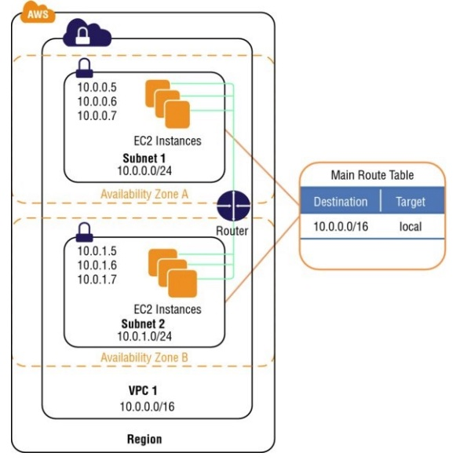
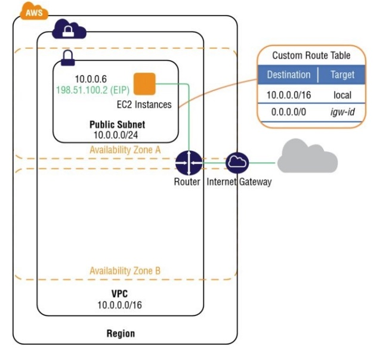
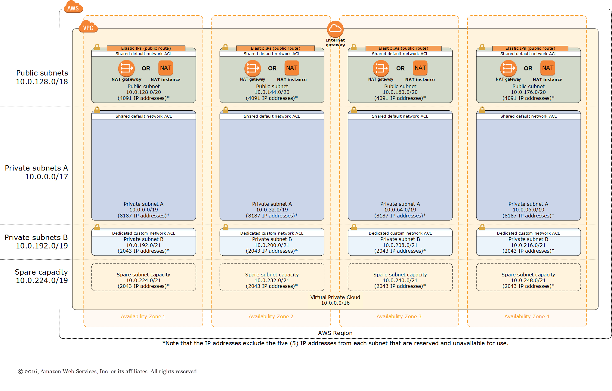
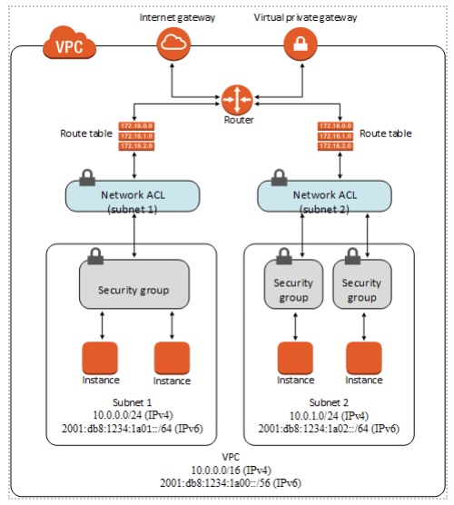

[<< Back to root module](../01-Theory.md)

# Amazon Virtual Private Cloud (VPC)

## Table of Content:

- [Overview](#overview)
- [Concepts for VPCs](#concepts-for-vpcs)
- [VPC Components](#vpc-components)
- [Use cases / Considerations](#use-cases--considerations)
- [VPC Security](#vpc-security)
- [Governance](#governance)
- [Limitations](#limitations)
- [Pricing considerations](#pricing-considerations)

## Overview

Amazon Virtual Private Cloud (Amazon VPC) lets you provision a logically isolated section of the Amazon Web Services (AWS) Cloud where you can launch AWS resources in a virtual network that you define. You have complete control over your virtual networking environment, including selection of your own IP address range, creation of subnets, and configuration of route tables and network gateways.

[What is AWS VPC?](https://docs.aws.amazon.com/vpc/latest/userguide/what-is-amazon-vpc.html) (read the root article
and run through the table of contents – you might want to get back to that later)

## Concepts for VPCs:

**Virtual private cloud (VPC)** — A virtual network dedicated to your AWS account.

**Subnet** — A range of IP addresses in your VPC.

**Route table** — A set of rules, called routes, that are used to determine where network traffic is directed to.

**Internet gateway** — A gateway that you attach to your VPC to enable communication between resources in your VPC and the internet.

**VPC endpoint** — Enables you to privately connect your VPC to supported AWS services and VPC endpoint services powered by PrivateLink without requiring an internet gateway, NAT device, VPN connection, or AWS Direct Connect connection. Instances in your VPC do not require public IP addresses to communicate with resources in the service. Traffic between your VPC and the other service does not leave the Amazon network.

**CIDR block** — Classless Inter-Domain Routing. An internet protocol address allocation and route aggregation methodology. For more information, see Classless Inter-Domain Routing in [Wikipedia](https://en.wikipedia.org/wiki/Classless_Inter-Domain_Routing).

Figure below illustrates an Amazon VPC with an address space of `10.0.0.0/16`, two subnets with different address ranges (`10.0.0.0/24` and `10.0.1.0/24`) placed in different Availability Zones, and a route table with the local route specified.

## VPC Components

An Amazon VPC consists of the following components:
- Subnets
- Route tables
- Dynamic Host Configuration Protocol (DHCP) option sets
- Security groups
- Network Access Control Lists (ACLs)

An Amazon VPC has the following optional components:
- Internet Gateways (IGWs)
- Elastic IP (EIP) addresses
- Elastic Network Interfaces (ENIs)
- Endpoints
- Peering
- Network Address Translation (NATs) instances and NAT gateways
- Virtual Private Gateway (VPG), Customer Gateways (CGWs), and Virtual Private Networks (VPNs)

Figure below illustrates an Amazon VPC with an address space of `10.0.0.0/16`, one subnet with
an address range of `10.0.0.0/24`, a route table, an attached IGW (Internet Gateway), and a single Amazon EC2 instance with a private IP address and an EIP address.

The route table contains two routes: the local route that permits inter-VPC communication and a route that sends all non-local traffic to the IGW (igw-id). Note that the Amazon EC2 instance has a public IP address (EIP, 198.51.100.2); this instance can be accessed from the Internet, and traffic may originate and
return to this instance.

### More Complex Set up:

## Use cases / Considerations

What can we do with a VPC?

- Launch instances into a subnet of your choose
- Assign custom IP address ranges in each subnet
- Configure route tables between subnets
- Create Internet gateway and attach it to our VPC
- Much better security control over your AWS resources
- Instance security groups
- Subnet network access control lists (ACLs)

## VPC Security

Amazon Virtual Private Cloud provides features that you can use to increase and monitor the security for your virtual private cloud (VPC):

- A **security group** acts as a virtual firewall for your instance to control inbound and outbound traffic. 
When you launch an instance in a VPC, you can assign up to five security groups to the instance.
Security groups act at the instance level, not the subnet level. 
Therefore, each instance in a subnet in your VPC can be assigned to a different set of security groups. 
For each security group, you add rules that control the inbound traffic to instances, and a separate set of rules that control the outbound traffic.
Security Groups are Stateful if you send a request from your instance, the response traffic for that request is allowed to flow in regardless of inbound security group rules.
Responses to allowed inbound traffic are allowed to flow out, regardless of outbound rules.
To find out more, read [Control traffic to resources using security groups](https://docs.aws.amazon.com/vpc/latest/userguide/VPC_SecurityGroups.html);

- A **network access control list (ACL)** is an optional layer of security for your VPC that acts as a firewall for controlling traffic in and out of one or more subnets. 
You might set up network ACLs with rules similar to your security groups in order to add an additional layer of security to your VPC.  
Network Access Control Lists are Stateless, which means that responses to allowed inbound traffic are subject to the rules for outbound traffic (and vice versa).

The following diagram illustrates the layers of security provided by security groups and network ACLs. For example, traffic from an internet gateway is routed to the appropriate subnet using the routes in the routing table. The rules of the network ACL that is associated with the subnet control which traffic is allowed to the subnet. The rules of the security group that is associated with an instance control which traffic is allowed to the instance:

### Difference between Security Group and NACL:

| Security Group                                                             | NACL                                                                                                                                                                    |
|----------------------------------------------------------------------------|-------------------------------------------------------------------------------------------------------------------------------------------------------------------------|
| Operates at the instance level (first layer of defense)                    | Operates at the subnet level (second layer of defense)                                                                                                                  |
| Supports "allow" rules only                                                | Supports allow rules and deny rules                                                                                                                                     |
| Stateful: Return traffic is automatically allowed, regardless of any rules | Stateless: Return traffic must be explicitly allowed by rules.                                                                                                          |
| AWS evaluates all rules before deciding whether to allow traffic           | AWS processes rules in number order when deciding whether to allow traffic.                                                                                             |
| Applied selectively to individual instances                                | Automatically applied to all instances in the associated subnets; this is a backup layer of defense, so you don’t have to rely on someone specifying the security group |

### Security best practices for your VPC

The following best practices are general guidelines and don’t represent a complete security solution. Because these best practices might not be appropriate or sufficient for your environment, treat them as helpful considerations rather than prescriptions.
- [The following are general best practices](https://docs.aws.amazon.com/vpc/latest/userguide/vpc-security-best-practices.html)

### Cautions

<table>
<thead>
	<tr>
		<th>Limit</th>
		<th>Default</th>
		<th>Adjustable</th>
		<th>Comments</th>
	</tr>
</thead>
<tbody>
	<tr>
		<td>Inbound or outbound rules per security group</td>
		<td>60</td>
		<td><a href='https://console.aws.amazon.com/servicequotas/home/services/vpc/quotas/L-0EA8095F'>up to 1000</a></td>
		<td>You can have 60 inbound and 60 outbound rules per security group (making a total of 120 rules). This quota is enforced separately for IPv4 rules and IPv6 rules; for example, a security group can have 60 inbound rules for IPv4 traffic and 60 inbound rules for IPv6 traffic. A quota change applies to both inbound and outbound rules. This quota multiplied by the quota for security groups per network interface cannot exceed 1,000.</td>
	</tr>
	<tr>
		<td>Security groups per network interface</td>
		<td>5</td>
		<td><a href='https://console.aws.amazon.com/servicequotas/home/services/vpc/quotas/L-2AFB9258'>up to 16</a></td>
		<td>This quota multiplied by the quota for rules per security group cannot exceed 1,000.</td>
	</tr>
</tbody>
</table>

***Calculations***:
max_capacity = (inbound_rules_ip4 + outbound_rules_ip4+inbound_rules_ip6 + outbound_rules_ip6) * sg_per_network_interface = (50 + 50 + 50 + 50) * 5 = 1000

## Governance

Monitoring tools/service:
- [VPC Flow logs](./01-01.FlowLogs.md)
- [CloudWatch](https://aws.amazon.com/ru/blogs/mt/monitor-network-throughput-of-interface-vpc-endpoints-using-amazon-cloudwatch/)

## Limitations

You can create 5 VPCs per Region. The quota for internet gateways per Region is directly correlated to this one.
Increasing this quota increases the quota on internet gateways per Region by the same amount. 
You can have 100s of VPCs per Region for your needs even though the default quota is 5 VPCs per Region.

You can request an increase for these quotas. For some of these quotas, you can view your current quota using the _Limits_ page of the [Amazon EC2 console](https://console.aws.amazon.com/ec2/v2/home?#Limits:)).

## Pricing considerations

[VPC Pricing](https://aws.amazon.com/vpc/pricing/)

[<< Back to root module](../01-Theory.md)
