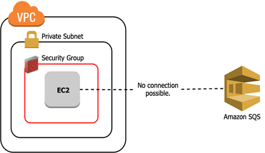
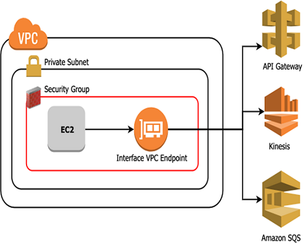
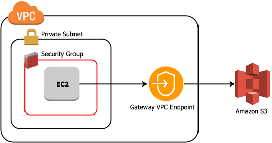

[<< Back to root module](../01-Theory.md)

# VPC Endpoint

## Table of Content:

- [Overview](#overview)
- [VPC Endpoint Types](#vpc-endpoint-types)
- [Why use VPC Interface Endpoints](#why-use-vpc-interface-endpoints)
- [List of Endpoints](#list-of-endpoints)

## Overview

A VPC endpoint enables you to privately connect your VPC to supported AWS services and VPC endpoint services powered by PrivateLink without requiring an internet gateway, NAT device, VPN connection, or AWS Direct Connect connection. Instances in your VPC do not require public IP addresses to communicate with resources in the service. Traffic between your VPC and the other service does not leave the Amazon network.

Without VPC endpoint it look something like that

## VPC Endpoint Types

### Interface endpoint

An interface endpoint is an elastic network interface with a private IP address from the IP address range of your subnet. It serves as an entry point for traffic destined to a service that is owned by AWS or owned by an AWS customer or partner.

### Gateway endpoint

These endpoints are **only available for S3 and DynamoDB**. As the name implies, these endpoints are not deployed as an interface in a subnet, but instead as a route on your route tables. The functionality of Gateway Endpoints is the same as for Interface Endpoints, including their support for endpoint policies. However Gateway Endpoints **are free**

## Use cases / Considerations

The two main reasons to use VPC Interface Endpoints are **security** and **performance**.

In a very sensitive environment, you want to guarantee that all AWS API calls stay within AWS’ networks and no data can be extracted to the internet. In this scenario, you will have no Internet Gateway and no NAT Gateway, so no outbound traffic is possible. However, this will also prohibit all interactions with AWS services, **so you need VPC endpoints for every service you use**. Also because the traffic over Private Link stays within Amazon’s networks, the physical distance travelled, the number of hops and the risk of traversing congested networks are all significantly lower.

### The balance of cost, security, and performance

Amazon does **not** provide this service **for free**, except gateway endpoint, and you should determine the value of using VPC Interface Endpoints for your workloads accordingly.

- [Amazon Interface Endpoint pricing](https://aws.amazon.com/privatelink/pricing/)

## List of Endpoints

- [AWS services that integrate with AWS PrivateLink](https://docs.aws.amazon.com/vpc/latest/privatelink/integrated-services-vpce-list.html)

[<< Back to root module](../01-Theory.md)
