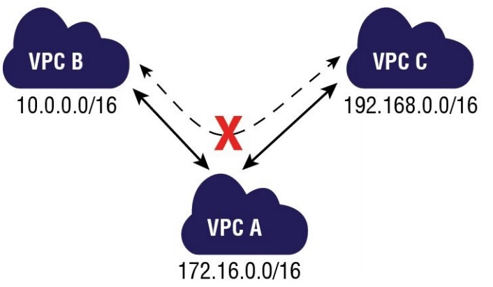

[<< Back to root module](../01-Theory.md)

# VPC Peering

## Table of Content:

- [Overview](#overview)
- [Overview](#overview)
- [VPC peering do not support transitive routing](#vpc-peering-do-not-support-transitive-routing)

## Overview

An Amazon VPC peering connection is a networking connection between two Amazon VPCs that enables instances in either Amazon VPC to communicate with each other as if they are within the same network. You can create an Amazon VPC peering connection between your own Amazon VPCs or with an Amazon VPC in another AWS account within a single region. A peering connection is neither a gateway nor an Amazon VPN connection and does not introduce a single point of failure for communication.

Peering connections are created through a request/accept protocol. The owner of the requesting Amazon VPC sends a request to peer to the owner of the peer Amazon VPC. If the peer Amazon VPC is within the same account, it is identified by its VPC ID. If the peer VPC is within a different account, it is identified by Account ID and VPC ID. The owner of the peer Amazon VPC has one week to accept or reject the request to peer with the requesting Amazon VPC before the peering request expires.

An Amazon VPC may have multiple peering connections, and peering is a one-to-one
relationship between Amazon VPCs, meaning two Amazon VPCs cannot have two peering
agreements between them. Also, peering connections do not support transitive routing.

## VPC peering do not support transitive routing:

In this figure, VPC A has two peering connections with two different VPCs: VPC B and VPC C. Therefore, VPC A can communicate directly with VPCs B and C. Because peering connections do not support transitive routing, VPC A cannot be a transit point for traffic between VPCs B and C. In order for VPCs B and C to communicate with each other, a peering connection must be explicitly created between them.

Here are the important points to understand about peering:

- You cannot create a peering connection between Amazon VPCs that have matching or overlapping CIDR blocks.
- Amazon VPC peering connections do not support transitive routing.
- You cannot have more than one peering connection between the same two Amazon VPCs at the same time.

### Use cases / Considerations
- __Peering two or more VPCs to provide full access to resources.__ In this scenario, you have two or more VPCs that you want to peer to enable full sharing of resources between all VPCs.
- __Peering to one VPC to access centralized resources.__ In this scenario, you have a central VPC that contains resources that you want to share with other VPCs. Your central VPC may require full or partial access to the peer VPCs, and similarly, the peer VPCs may require full or partial access to the central VPC.
- __Peering with ClassicLink.__ You can modify a VPC peering connection to enable one or more EC2-Classic instances that are linked to your VPC via ClassicLink to communicate with instances in the peer VPC. Similarly, you can modify a VPC peering connection to enable instances in your VPC to communicate with linked EC2-Classic instances in the peer VPC.

### Pricing considerations

There is no charge to create a VPC peering connection. All data transfer over a VPC Peering connection that stays within an Availability Zone (AZ) is free. Charges apply for data transfer over a VPC Peering connections that cross Availability Zones and Regions.

- [Amazon VPC peering connection pricing ](https://docs.aws.amazon.com/vpc/latest/peering/what-is-vpc-peering.html)

[<< Back to root module](../01-Theory.md)
