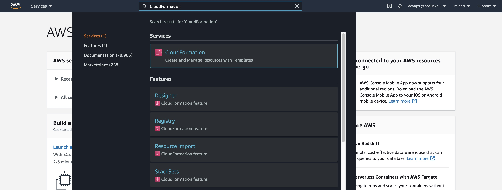
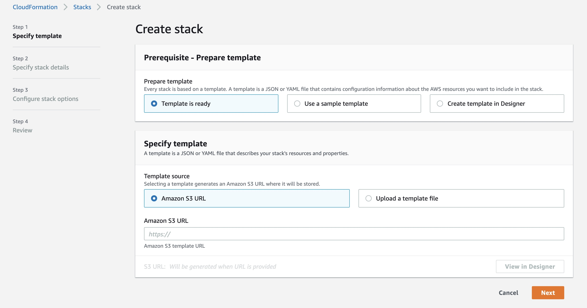
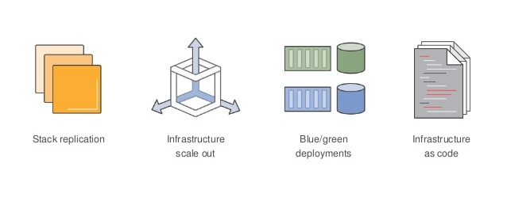
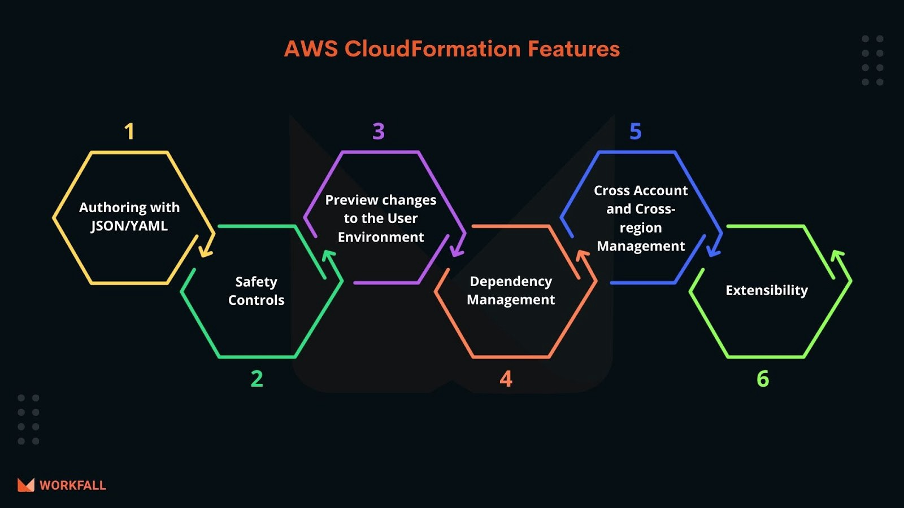
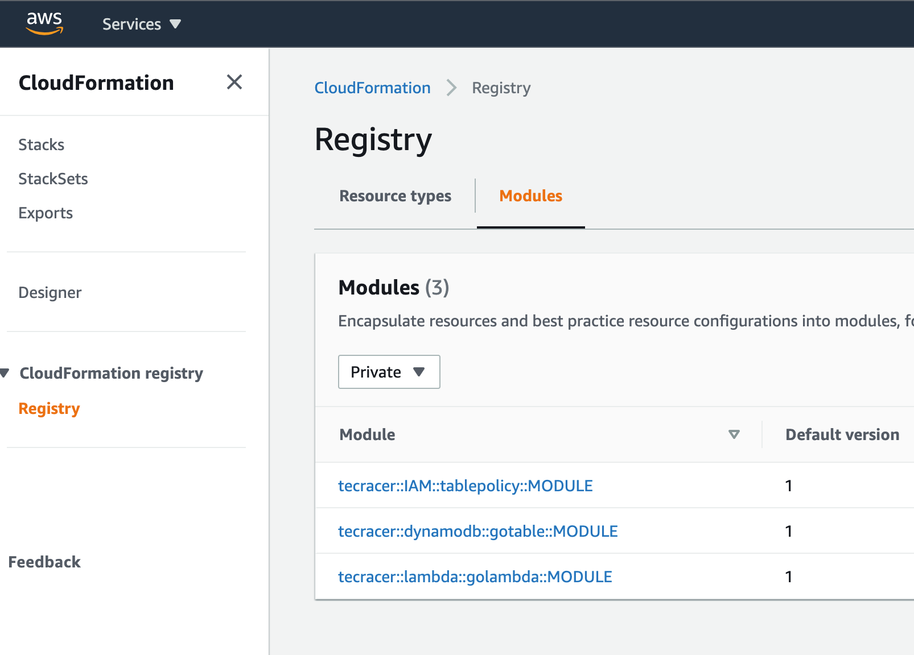
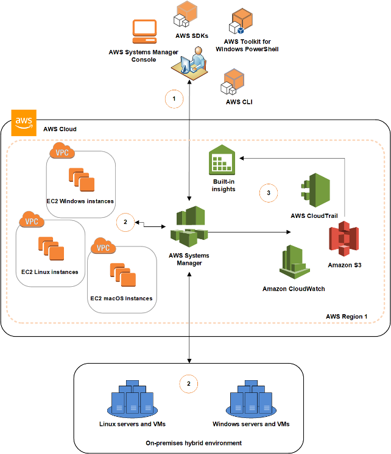

# AWS Provisioning Services

## Table of Content

- [Your goals](#your-goals)
- [Cloudformation](#cloudformation)
- [Systems Manager](#aws-systems-manager-ssm)
- [Secret Management in AWS](#secret-management-in-aws)
- [Hands-on Labs](#hands-on-labs)

## Your goals

- Explain what CloudFormation template and stack are 

- Understand templating basics and change sets 

- Know how to deploy applications using CloudFormation

- Be able to explain SSM concepts, its categories and use cases

- Be able to tell about secret management best practices. Name AWS services which can help to manage your secrets.

## Self check:

1. If you don't want to apply updates to CFN template right away, but just check the changes, what do you need?
2. What will you do to deploy several CFN stacks at once?
3. Can you deploy a resource on condition using CFN? If yes, how?
4. How can you use the same template for multiple environments?
5. Where can you view the results of template execution?

## Cloudformation

AWS CloudFormation is a service that helps you model and set up your Amazon Web Services resources so that you can spend less time managing those resources and more time focusing on your applications that run in AWS. You create a template that describes all the AWS resources that you want (like Amazon EC2 instances or Amazon RDS DB instances), and CloudFormation takes care of provisioning and configuring those resources for you.
Generally speaking, it gives developers and systems administrators an easy way to create and manage a collection of related AWS resources.

Official guide start page:
- https://docs.aws.amazon.com/AWSCloudFormation/latest/UserGuide/Welcome.html

### Use cases and features

- Builds the infrastructure using text templates or visually with - Cloudformation Designer.
- Infrastructure as Code implementation through version control.
- Change Sets allow to preview proposed changes before applying.
- Custom extensions creation using AWS Lambda.

### Pricing considerations
No additional charge for the service. You will be paid only for resources created using Cloudformation. [AWS CloudFormation pricing](https://aws.amazon.com/cloudformation/pricing/?did=ap_card&trk=ap_card)

### More details

#### Main concepts
Cloudformation operates with templates and stacks. Template contains all the resources you want to be created using JSON or YAML formatted text.
Stack is a logical unit of related resources. You create, update, and delete a collection of resources by creating, updating, and deleting stacks.
If you need to make changes to the running resources in a stack, you update the stack. Before making changes to your resources, you can generate a change set, which is a summary of your proposed changes. Change sets allow you to see how your changes might impact your running resources, especially for critical resources, before implementing them.

https://docs.aws.amazon.com/AWSCloudFormation/latest/UserGuide/cfn-whatis-concepts.html

#### How it works

https://docs.aws.amazon.com/AWSCloudFormation/latest/UserGuide/cfn-whatis-howdoesitwork.html

#### Template basics
A template is a declaration of the AWS resources that make up a stack. The template is stored as a text file whose format complies with the JSON or YAML standard. Because they are just text files, you can create and edit them in any text editor and manage them in your source control system with the rest of your source code. In the template, you declare the AWS resources you want to create and configure. You declare an object as a name-value pair or a pairing of a name with a set of child objects enclosed.
Templates include several major sections. The Resources section is the only required section. Some sections in a template can be in any order. However, as you build your template, it can be helpful to use the logical order shown in the following list because values in one section might refer to values from a previous section.

https://docs.aws.amazon.com/AWSCloudFormation/latest/UserGuide/gettingstarted.templatebasics.html

https://docs.aws.amazon.com/AWSCloudFormation/latest/UserGuide/template-anatomy.html

#### Change sets
When you need to update a stack, understanding how your changes will affect running resources before you implement them can help you update stacks with confidence. Change sets allow you to preview how proposed changes to a stack might impact your running resources, for example, whether your changes will delete or replace any critical resources, AWS CloudFormation makes the changes to your stack only when you decide to execute the change set, allowing you to decide whether to proceed with your proposed changes or explore other changes by creating another change set. You can create and manage change sets using the CloudFormation console, AWS CLI, or CloudFormation API.

https://docs.aws.amazon.com/AWSCloudFormation/latest/UserGuide/using-cfn-updating-stacks-changesets.html

#### Modules and Registry
Modules are building blocks that can be reused across multiple CloudFormation templates and is used just like a native CloudFormation resource. (CloudFormation modules are available in the CloudFormation registry)

The CloudFormation registry lets you manage extensions, both public and private, such as resources, modules, and hooks that are available for use in your AWS account. Currently, you can use the following extension types in the AWS registry: resources types, modules, and hooks.

#### Deploying apps
You can use AWS CloudFormation to automatically install, configure, and start applications on Amazon EC2 instances. Doing so enables you to easily duplicate deployments and update existing installations without connecting directly to the instance, which can save you a lot of time and effort.
CloudFormation includes a set of helper scripts (cfn-init, cfn-signal, cfn-get-metadata, and cfn-hup) that are based on cloud-init. You call these helper scripts from your CloudFormation templates to install, configure, and update applications on Amazon EC2 instances that are in the same template.

https://docs.aws.amazon.com/AWSCloudFormation/latest/UserGuide/deploying.applications.html

#### Video
- AWS Cloudformation Deep Dive and recent enhancements: https://www.youtube.com/watch?v=d6SJPMdBShI

### Useful Links
- [Getting started with CloudFormation (AWS docs)](https://aws.amazon.com/cloudformation/getting-started/)
- [CloudFormation Best Practices (AWS docs)](https://docs.aws.amazon.com/AWSCloudFormation/latest/UserGuide/best-practices.html)
- [CloudFormation FAQs (AWS docs)](https://aws.amazon.com/cloudformation/faqs/?nc=sn&loc=5)
- [CloudFormation Tutorial by "Simplilearn" (video)](https://aws.amazon.com/cloudformation/faqs/?nc=sn&loc=5)
- [AWS Serverless Application Model (AWS docs)](https://aws.amazon.com/serverless/sam/)
- [Introducing AWS CloudFormation modules](https://aws.amazon.com/blogs/mt/introducing-aws-cloudformation-modules/)
- [Introducing a Public Registry for AWS CloudFormation](https://aws.amazon.com/blogs/aws/introducing-a-public-registry-for-aws-cloudformation/)
- [Using the AWS CloudFormation registry](https://docs.aws.amazon.com/AWSCloudFormation/latest/UserGuide/registry.html)
- [Cloudformation cli installation (cfn)](https://docs.aws.amazon.com/cloudformation-cli/latest/userguide/what-is-cloudformation-cli.html)

## AWS Systems Manager (SSM)

AWS Systems Manager (formerly known as SSM) is an AWS service that you can use to view and control your infrastructure on AWS. Using the Systems Manager console, you can view operational data from multiple AWS services and automate operational tasks across your AWS resources. Systems Manager helps you maintain security and compliance by scanning your managed instances and reporting on (or taking corrective action on) any policy violations it detects. 

A managed instance is a machine that has been configured for use with Systems Manager. Systems Manager also helps you configure and maintain your managed instances. Supported machine types include Amazon Elastic Compute Cloud (Amazon EC2) instances, on-premises servers, and virtual machines (VMs), including VMs in other cloud environments. Supported operating system types include Windows Server, macOS, Raspbian, and multiple distributions of Linux. 

Using Systems Manager, you can associate AWS resources together by applying the same identifying resource tag to each of them. You can then view operational data for these resources as a resource group, to help monitor and troubleshoot. 

This diagram shows a general example of the different processes that AWS Systems Manager performs when performing an action like sending a command to your fleet of servers or performing an inventory of the applications running on your on-premises servers. Each Systems Manager capability, uses a similar process of set up, launching, processing, and reporting. For example, Run Command and Maintenance Windows are each capabilities of Systems Manager. 

1. **Configure Systems Manager** – Use the Systems Manager console, SDK, AWS Command Line Interface (AWS CLI), or AWS Tools for Windows PowerShell to configure, schedule, automate, and run actions that you want to perform on your AWS resources. 

2. **Verification and processing** – Systems Manager verifies the configurations, including permissions, and sends requests to the AWS Systems Manager SSM Agent running on your instances or servers in your hybrid environment. SSM Agent performs the specified configuration changes. 

3. **Reporting** – SSM Agent reports the status of the configuration changes and actions to Systems Manager in the AWS Cloud. Systems Manager then sends the status to the user and various AWS services, if configured. 

Systems Manager is comprised of individual capabilities, which are grouped into five categories: 
- Operations Management
- Application Management
- Change Management
- Node Management
- Shared Resources

This is a powerful set of tools and features that you can use to perform many operational tasks. For example:

- Group AWS resources together by any purpose or activity you choose, such as application, environment, region, project, campaign, business unit, or software lifecycle.
- Centrally define the configuration options and policies for your managed instances.
- Centrally view, investigate, and resolve operational work items related to AWS resources.
- Automate or schedule a variety of maintenance and deployment tasks.
- Use and create runbook-style SSM documents that define the actions to perform on your managed instances.
- Run a command, with rate and error controls, that targets an entire fleet of managed instances.
- Securely connect to a managed instance with a single click, without having to open an inbound port or manage SSH keys.
- Separate your secrets and configuration data from your code by using parameters, with or without encryption, and then reference those parameters from a number of other AWS services.
- Perform automated inventory by collecting metadata about your Amazon EC2 and on-premises managed instances. Metadata can include information about applications, network configurations, and more.
- View consolidated inventory data from multiple AWS Regions and accounts that you manage.
- Quickly see which resources in your account are out of compliance and take corrective action from a centralized dashboard.
- View active summaries of metrics and alarms for your AWS resources.

### Pricing considerations

- [Amazon Systems Manager pricing](https://aws.amazon.com/systems-manager/pricing/?did=ap_card&trk=ap_card)

### Useful links:
- [What is AWS Systems Manager? (Video)](https://youtu.be/MK4ZoCs-muo)
- [AWS Systems Manager](https://docs.aws.amazon.com/systems-manager/latest/userguide/what-is-systems-manager.html)
- [SSM Capabilities](https://docs.aws.amazon.com/systems-manager/latest/userguide/features.html)
- [How SSM works](https://docs.aws.amazon.com/systems-manager/latest/userguide/how-it-works.html)
- [Accessing Systems Manager](https://docs.aws.amazon.com/systems-manager/latest/userguide/access-methods.html)
- [Systems Manager prerequisites](https://docs.aws.amazon.com/systems-manager/latest/userguide/systems-manager-prereqs.html)
- [AWS Systems Manager Pricing](https://aws.amazon.com/systems-manager/pricing/)

[Please find More Details](02-SSM.md)

## [Secret Management in AWS](03-secretsManagement.md)

## Hands-on Labs:
  [Get the hands-on experience with basic and advanced labs](04-hands-on-labs.md)
