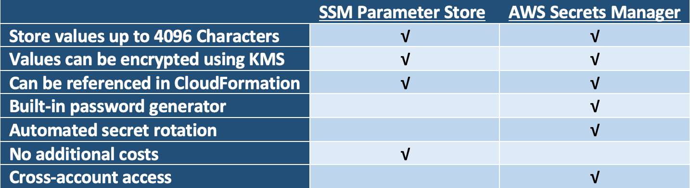

# Secrets management in AWS

## Secrets management overview

Secrets management refers to the tools and methods for managing digital authentication credentials (secrets), including passwords, keys, APIs, and tokens for use in applications, services, privileged accounts and other sensitive parts of the IT ecosystem.

#### The best practices for a secrets management solution.

 - ##### Centralizing your secrets
One place to manage passwords, API keys, certificates, and other sensitive data to inject secrets into build, deploy and run time pipelines and etc.

 - ##### Access control lists (ACLs)
When you have your secrets centralized into one place, is ensuring that who's accessing those actually should be accessing those secrets. So building out proper ACLs of humans and machines, applications, who should be able to access what, and providing an easy way for them to gain access to the secrets that they need. So step one, centralize. Step two, make sure that you have proper access control around the secrets.

- ##### Dynamic secrets
 A technique where new secrets are created on-demand, when the application needs them. 
 Most dynamic secrets solutions create a secret at the time that it is needed, and also deliver it to the application. Usually this secret is reused and set to expire after a few days.  Some dynamic secrets solutions also create a new user name or account every time a new secret is created, so the user names become dynamic too.
 
- ##### Encryption as a service
Encryption as a Service (EaaS) is a subscription model that provides cloud service consumers to benefit from encryption's security without bothering to configure and maintain encryption on their own. EaaS takes advantage of the “as a service” concept to make data encryption a simple, pay-as-you-go service the customer purchases from their cloud provider.

- #####  Auditing
We should be able to see when the secret was actually used in the underlying subsystem that the credential was created for. For encryption as a service we should see who was accessing an encrypt or a decrypt operation. It gives us complete visibility into everything that's going on in our infrastructure.

## Services Overview
---

Security is an important aspect of any infrastructure especially for infrastructures in the Cloud. However, best security practices regarding parameters and secrets often are overlooked during fast and iterative application deployment cycles. Wouldn’t it be nice if AWS had managed services to help with store parameters and secrets while keeping security best practices intact? You’re in luck!

One such service is [SSM Parameter Store](https://aws.amazon.com/systems-manager/features/) which is a secured and managed key/value store perfect for storing parameters, secrets, and configuration information. However, in April of 2018, AWS also introduced another service called [AWS Secrets Manager](https://aws.amazon.com/secrets-manager/) that offers similar functionality. Given that both services kind of do the same thing, which to choose isn’t clear. With that in mind, let us take a look at the similarities and differences of these two services to better understand which service will best fit your architectural needs.

There are two services which helps to manage secrets:

- SSM Parameter Store(secure string feauture)
- AWS Secrets Manager

## Use cases / Considerations
---
### Similarities

* ##### Managed Key/Value Store Services
As mentioned earlier there are many similarities between these two services. Both of these services offer a solution to store values under a name or key. Both services can store values up to 4096 characters and allow the keys to have prefixes. Similar to S3, both SSM Parameter Store and AWS Secrets Manager allow you to prefix parameter names. For example, parameters or secrets can be put in the following prefix schema application/environment/parametername or any other combination of prefixes that meets the need of the application. This is useful since the deployment of the application can reference different parameters/secrets based on the environment it is deploying to.
* ##### Similar Encryption Options
Both services can leverage [AWS KMS](https://aws.amazon.com/kms/) to encrypt values. By using KMS, IAM policies can be configured to control permissions on which IAM users and roles have permission to decrypt the value. Though access to the values can be restricted through IAM, encryption provides an additional layer of security and is sometimes required for compliance.

SSM Parameter provides an option to store values in plaintext or encrypt it with a KMS key. AWS Secrets Manager only stores encrypted data (otherwise it would not be a secret if the value was stored in plaintext; it would be an unsecured parameter). The article found [HERE](https://docs.aws.amazon.com/kms/latest/developerguide/services-secrets-manager.html) describes in greater detail on how AWS Secrets Manager encrypts its secrets. Similarly, SSM Parameter store encryption documentation can be found [HERE](https://docs.aws.amazon.com/kms/latest/developerguide/services-parameter-store.html).

* ##### Both Referenceable in CloudFormation
Writing on how SSM Parameter Store and AWS Secrets Manager interact with CloudFormation can be a whole separate article. However, the summary is that values from both services are referenceable in CloudFormation templates allowing you to not hard code secrets or other dynamic values. For example, when creating an RDS instance through CloudFormation it is poor practice to hard code the master password in the CloudFormation script. What can be done instead is that the master’s username and password can be stored in a secret and CloudFormation can reference that secret during the provisioning of the RDS resource. This way the CloudFormation script has only a pointer to where the password is located instead of containing the password in plaintext.

Similarly, other parameters (not just password) can be referenced the same way to provide more dynamic CloudFormation scripts. The article found [HERE](https://docs.aws.amazon.com/AWSCloudFormation/latest/UserGuide/dynamic-references.html) provides more information on how to use parameters or secrets in AWS CloudFormation.

### Differences
---

- ##### Password Generation
Though the services are similar, there are also a number of differences between them. The first difference is that AWS Secrets Manager is able to generate random secrets through the AWS CLI or SDK. For example, when creating a new RDS instance through a CloudFormation template, you can also create a randomly generated password and reference it in the RDS configuration since it requires a master username and password. The CloudFormation can store the username and password in an AWS Secrets Manager secret that can be only accessed by Database Admins.

Password generation is not only useful in CloudFormation templates, but applications (through the SDK) can also leverage this feature. The functionality to generate random strings is only available to AWS Secrets Manager and not available in SSM Parameter Store.
- ##### Secrets Rotation
Another feature unique to AWS Secrets Manger is the ability to rotate the secret value. Out of the box, AWS Secrets Manager provides full key rotation integration with RDS. This means that AWS Secrets Manager can rotate keys and actually apply the new key/password in RDS for you. For services other than RDS, AWS allows you to write custom key rotation logic using an AWS Lambda function. Further information regarding AWS Secrets Manager key rotation can be found HERE.
- ##### Cross Account Access
Another way AWS Secrets Manager is substantially different from SSM Parameter store, is that secrets can be shared across accounts. For example, IAM users and application resources in one development or production AWS account will be able access secrets stored in a different AWS account (e.g. Security AWS Account). Such functionality is also beneficial for use cases where a customer needs to share a particular secret with a partner. The article found [HERE](https://aws.amazon.com/blogs/security/how-to-access-secrets-across-aws-accounts-by-attaching-resource-based-policies/) demonstrates how to setup a cross-account AWS Secrets Manager secret.

## Governance
---

## Cautions
---
Secrets Manager is paid AWS service.

Pricing considerations
There are no additional charges for using SSM Parameter Store. However, there are limit of 10,000 parameters per account. On the other hand, AWS Secrets Manager does accrue additional costs. At the time of this writing, it costs $0.40 per secret stored and additional $0.05 for 10,000 API calls.

## More details
---
Links to official guides, videos, etc – unstructured data

https://www.1strategy.com/blog/2019/02/28/aws-parameter-store-vs-aws-secrets-manager/

https://tutorialsdojo.com/aws-secrets-manager-vs-systems-manager-parameter-store/

https://aws.amazon.com/secrets-manager/

https://docs.aws.amazon.com/systems-manager/latest/userguide/systems-manager-parameter-store.html

https://aws.amazon.com/about-aws/whats-new/2018/07/aws-systems-manager-parameter-store-integrates-with-aws-secrets-manager-and-adds-parameter-version-labeling/

https://docs.aws.amazon.com/systems-manager/latest/userguide/integration-ps-secretsmanager.html

https://docs.aws.amazon.com/AmazonECS/latest/developerguide/specifying-sensitive-data-secrets.html

https://docs.aws.amazon.com/AmazonECS/latest/developerguide/specifying-sensitive-data-parameters.html
