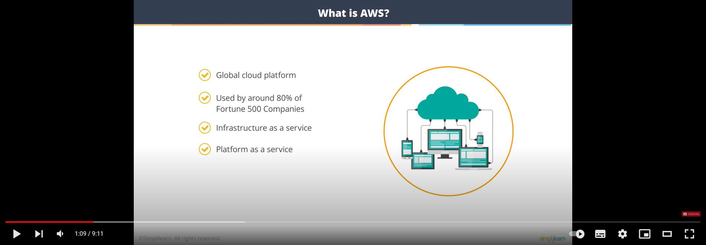

>## ! DISCLAIMER
>Despite the most of the labs in this course can be done using the AWS free tier, i.e. without any charging, there a couple of tasks that require creation of paid resources.
Resources like NAT Gateway, Route53 zone etc., will cost you some money (but not that much, fortunately). Anyway, before creating any type of resources, please be sure you carefully read and understood the appropriate pricing policy. Every type of resource is AWS has its own pricing page, for example [Route53 pricing](https://aws.amazon.com/route53/pricing/). If you cannot find the pricing policy in official AWS documentation, just google it, for example "NAT gateway pricing".
To avoid extra money expenditures, you can [set up a billing alert](https://docs.aws.amazon.com/AmazonCloudWatch/latest/monitoring/monitor_estimated_charges_with_cloudwatch.html) that will notify you immediately after you have reached some threshold in your billing.
And of course, do not forget cleaning up all the unnecessary resources after completing the lab.

### Additional useful materials

- AWS Essential Training for Developers (2019) linkedin self-study course (**optional**, takes 4h 8m)
[https://www.linkedin.com/learning/aws-essential-training-for-developers](https://www.linkedin.com/learning/aws-essential-training-for-developers)

- Amazon Web Services: Controlling Cost (2018) linkedin self-study course (**optional**, takes 2h 31m)
[https://www.linkedin.com/learning/amazon-web-services-controlling-cost](https://www.linkedin.com/learning/amazon-web-services-controlling-cost)

- Tracking your AWS **Free Tier usage**
[https://docs.aws.amazon.com/awsaccountbilling/latest/aboutv2/tracking-free-tier-usage.html](https://docs.aws.amazon.com/awsaccountbilling/latest/aboutv2/tracking-free-tier-usage.html)

- About AWS
[https://habr.com/ru/post/138695/](https://habr.com/ru/post/138695/)

- AWS hub
[https://habr.com/ru/hub/aws/](https://habr.com/ru/hub/aws/)

# Your goals

- Know about AWS Fundamentals Course  

- Be familiar with "The Six Pillars of AWS"

- Understand "Shared Responsibility Model" 

- Have an idea about AWS CLI 

- Learn about Tags

- Know about AWS Support

- Learn about AWS Quotas

- Know about AWS Cost Management

- Get brief familiarity with AWS provided services and domains 

- Budget alerts 

# AWS Cloud Overview

   **Amazon Web Services (AWS)** is the world’s most comprehensive and broadly adopted cloud platform, offering over 200 fully featured services from data centers globally.
   AWS has the most extensive global cloud infrastructure. No other cloud provider offers as many Regions with multiple Availability Zones connected by low latency, high throughput, and highly redundant networking. AWS has 80 Availability Zones within 25 geographic regions around the world, and has announced plans for 15 more Availability Zones and 5 more AWS Regions.

   The platform is developed with a combination of infrastructure as a service (IaaS), platform as a service (PaaS) and packaged software as a service (SaaS) offerings.

Amazon Web Services (AWS) is a cloud computing platform that offers a wide range of services and tools for businesses and individuals. Some of the specific AWS services include:

1)    EC2 (Elastic Compute Cloud): This service provides resizable compute capacity in the cloud, making it easy to deploy and manage applications.

2)    S3 (Simple Storage Service): This is a scalable and highly durable storage service that is ideal for storing and retrieving large amounts of data.

3)    RDS (Relational Database Service): This is a managed database service that makes it easy to set up, operate, and scale a relational database in the cloud.

4)    Lambda: This is a serverless computing service that allows you to run your code in response to events and automatically manages the underlying infrastructure.

5)    Elastic Load Balancing: This service distributes incoming traffic across multiple instances to ensure that your applications are always available and responsive.

6)    CloudFront: This is a content delivery network (CDN) that securely delivers data, videos, applications, and APIs to customers globally.

7)    Amazon DynamoDB: Amazon DynamoDB is a fully managed NoSQL database service that provides fast and predictable performance with seamless scalability. DynamoDB is designed to support both document and key-value data models, making it a versatile database for a wide range of use cases. Benefits of DynamoDB include fast and predictable performance, seamless scalability, and automatic data replication across multiple availability zones.

AWS has several benefits over other large cloud providers, including:

1)    Pricing: AWS has a flexible pricing model that allows users to pay only for the resources they consume, which can result in significant cost savings.

2)    Scalability: AWS makes it easy to scale your infrastructure up or down as your needs change, so you don't have to worry about overprovisioning or underprovisioning.

3)    Security: AWS offers a wide range of security features, including identity and access management, encryption, and network security, to ensure that your data is always protected.

4)    Reliability: AWS has a highly reliable infrastructure that ensures your applications are always available and responsive.

5)    Innovation: AWS is constantly innovating and releasing new services and features, which means that users always have access to the latest and greatest technology.

### Before you get started:
AWS overview in 10 minutes.
  

## AWS Fundamentals. 
### Core Concepts
Please learn carefully the following AWS Fundamentals course: 
>Click here >> [AWS FUNDAMENTALS](https://aws.amazon.com/getting-started/fundamentals-core-concepts/)

This AWS Fundamentals Course is designed to teach you the core concepts you need to work effectively within AWS.
When first starting, AWS can seem overwhelming. A cloud-native paradigm of building infrastructure can be a radical departure from the traditional on-premises way of doing things. And regardless if this is your first time working with infrastructure or you've been tuning Linux kernels for the last decade, it can be hard to know where to start with AWS's selection of over 175 services.

The AWS Fundamentals Course is designed to help you get started with AWS regardless of your experience. In this course, we will teach you about the [six pillars](https://aws.amazon.com/architecture/well-architected/?e=gs2020&p=fundcore&p=gsrc&c=fcc) of AWS, mental models to use when thinking about the cloud, and key concepts that will be applicable across any service you end up using.
Structure
The AWS Fundamentals Course will be divided into five modules. Each module will follow the following format:

- **Intro**: A short description of the pillar we will be focusing on
- **Mental Model**: A guiding mental model to help you understand the concepts introduced in each pillar
- **Concepts**: Key concepts covering broad foundational topics for each pillar
- **Conclusion**: Summary of what we discussed
- **Further Reading**: Additional links and resources

#### The Six Pillars
  

The Six Pillars covered in the AWS Fundamentals Course come from the [AWS Well-Architected Framework](https://aws.amazon.com/architecture/well-architected/?e=gs2020&p=fundcore&p=gsrc&c=fcc). 
The Well-Architected Framework is the distillation of over a decade of experience building scalable applications on the cloud.
The Six Pillars consist of the following areas: ***Operational Excellence***, ***Security***, ***Reliability***, ***Performance Efficiency***, ***Cost Optimization***, and ***Sustainability***.

### Shared Responsibility Model

Security and Compliance is a shared responsibility between AWS and the customer. 
This shared model can help relieve the customer’s operational burden as AWS operates, 
manages and controls the components from the host operating system and virtualization 
layer down to the physical security of the facilities in which the service operates. 
The customer assumes responsibility and management of the guest operating system 
(including updates and security patches), other associated application software as well 
as the configuration of the AWS provided security group firewall. 
Customers should carefully consider the services they choose as their responsibilities 
vary depending on the services used, the integration of those services into their 
IT environment, and applicable laws and regulations. The nature of this shared 
responsibility also provides the flexibility and customer control that permits 
the deployment. As shown in the chart below, this differentiation of responsibility 
is commonly referred to as Security “of” the Cloud versus Security “in” the Cloud.

**AWS responsibility “Security of the Cloud”** - AWS is responsible for protecting 
the infrastructure that runs all of the services offered in the AWS Cloud. 
This infrastructure is composed of the hardware, software, networking, and facilities 
that run AWS Cloud services.

**Customer responsibility “Security in the Cloud”** – Customer responsibility will be 
determined by the AWS Cloud services that a customer selects. This determines the amount 
of configuration work the customer must perform as part of their security responsibilities. 
For example, a service such as Amazon Elastic Compute Cloud (Amazon EC2) is categorized 
as Infrastructure as a Service (IaaS) and, as such, requires the customer to perform all 
of the necessary security configuration and management tasks. Customers that deploy an 
Amazon EC2 instance are responsible for management of the guest operating system 
(including updates and security patches), any application software or utilities installed 
by the customer on the instances, and the configuration of the AWS-provided firewall 
(called a security group) on each instance. For abstracted services, such as Amazon S3 
and Amazon DynamoDB, AWS operates the infrastructure layer, the operating system, 
and platforms, and customers access the endpoints to store and retrieve data. 
Customers are responsible for managing their data (including encryption options), 
classifying their assets, and using IAM tools to apply the appropriate permissions.

For more information please checkout the following materails: > [Shared Responsibility Model](https://aws.amazon.com/compliance/shared-responsibility-model/)

### What is the AWS Command Line Interface?

The AWS Command Line Interface (AWS CLI) is an open source tool that enables you to interact with AWS services using commands in your command-line shell. With minimal configuration, the AWS CLI enables you to start running commands that implement functionality equivalent to that provided by the browser-based AWS Management Console from the command prompt in your terminal program:

- Linux shells – Use common shell programs such as bash, zsh, and tcsh to run commands in Linux or macOS.
- Windows command line – On Windows, run commands at the Windows command prompt or in PowerShell.
- Remotely – Run commands on Amazon Elastic Compute Cloud (Amazon EC2) instances through a remote terminal program such as PuTTY or SSH, or with AWS Systems Manager.

For more information please checkout the following materails: > [AWS CLI](https://docs.aws.amazon.com/cli/latest/userguide/cli-chap-welcome.html)

### [Video Course]: AWS Overview based on AWS Practitioner certification:
**Course Description**: This course is about basic AWS services and concepts. 
All topics in it will help to prepare and pass AWS Practitioner Certification.
  

### General description:

AWS Support offers a range of plans that provide access to tools and expertise that support your AWS solutions&#39; success and operational health. All support plans provide 24/7 access to customer service, AWS documentation, technical papers, and support forums. For technical support and more resources to plan, deploy, and improve your AWS environment, you can choose a support plan that best aligns with your AWS use case.

AWS for each account provides a basic plan. The basic plan is free for each AWS customer. You are able to change the basic plan to three different paid plans:

- Developer
- Business
- Enterprise

### Detailed overview

A detailed overview and compare existing plans are available here:

[https://aws.amazon.com/premiumsupport/plans/](https://aws.amazon.com/premiumsupport/plans/)

Keep in mind most major features available across all plans.

All AWS customers automatically have 24/7 access to these features of Basic Support:

- One-on-one responses to account and billing questions;
- Support forums;
- Service health checks;
- Documentation, technical papers, and best practice guides.

Customers with a Developer Support plan have access to these additional features:

- Everything covered from the basic plan;
- Best practice guidance;
- Building-block architecture support: guidance on how to use AWS products, features, and services together;
- Supports an unlimited number of support cases that can be opened by one primary contact, which is the AWS account root user.

Business Support or Enterprise Support plan have access to the next features:

- Use-case guidance – What AWS products, features, and services to use to best support your specific needs;
- AWS Trusted Advisor – A feature of AWS Support, which inspects customer environments and identifies opportunities to save money, close security gaps, and improve system reliability and performance. You can access all Trusted Advisor checks;
- The AWS Support API to interact with Support Center and Trusted Advisor. You can use the AWS Support API to automate support case management and Trusted Advisor operations;
- Third-party software support – Help with Amazon Elastic Compute Cloud (Amazon EC2) instance operating systems and configuration. Also, help with the performance of the most popular third-party software components on AWS. Third-party software support isn&#39;t available for customers on Basic or Developer Support plans;
- Supports an unlimited number of AWS Identity and Access Management (IAM) users who can open technical support cases.

Enterprise Support plan have access to next features:

- Application architecture guidance – Contextual guidance on how services fit together to meet your specific use case, workload, or application;
- Infrastructure event management – Short-term engagement with AWS Support to get a deep understanding of your use case. After analysis, provide architectural and scaling guidance for an event;
- Technical account manager – Work with a technical account manager (TAM) for your specific use cases and applications;
- White-glove case routing;
- Management business reviews.

##### _Note_:

_Good idea moving from basic to more high plan just when it needs only. For instance, if you need additional support from AWS or_ _temporarily_ _need to have some features which available only in more high plans, you can get it in the next 30 days. And after, to move back to the basic (develop) plan._

##### _Keep in mind_:

_For urgently contact with AWS support, use a chat or phone call as an answer method._

### Monitoring status

You can easy to monitor all statuses of your case in the Support Center. A flow looks like this:

1. Unassigned
2. Work in Progress (WIP)
3. Pending Customer Action (ask for more information) or Pending Amazon Action (let you know that the case is being investigated)
4. The last status is close Case. It means your problem is solved.  If you don&#39;t respond within ten days, the case is closed automatically. Nevertheless, you can always reopen a resolved or closed case.

For each update, you receive email with the correspondence and a link to the case in Support Center.

##### _Important note_:

- _You can&#39;t respond to case correspondence by email. Use the link in the email to navigate to the support case._
- _You must sign in to the AWS account that submitted the support case. If you sign in as an IAM user, you must have the required permissions to view support cases._

### Useful links:

- How do I change my AWS Support plan?

[https://aws.amazon.com/premiumsupport/knowledge-center/change-support-plan/](https://aws.amazon.com/premiumsupport/knowledge-center/change-support-plan/)

- How do I sign up for an AWS Support plan?

[https://aws.amazon.com/premiumsupport/knowledge-center/sign-up-support/](https://aws.amazon.com/premiumsupport/knowledge-center/sign-up-support/)

- Getting started with AWS Support:

[https://docs.aws.amazon.com/awssupport/latest/user/getting-started.html](https://docs.aws.amazon.com/awssupport/latest/user/getting-started.html)

- Access AWS Support

[https://docs.aws.amazon.com/awssupport/latest/user/accessing-support.html](https://docs.aws.amazon.com/awssupport/latest/user/accessing-support.html)

- Changing your AWS Support plan

[https://docs.aws.amazon.com/awssupport/latest/user/changing-support-plans.html](https://docs.aws.amazon.com/awssupport/latest/user/changing-support-plans.html)

---
## **Tagging AWS resources**

You can assign metadata to your AWS resources in the form of tags. Each tag is a label consisting of a user-defined key and value. Tags can help you manage, identify, organize, search for, and filter resources. Tags enable you to categorize your AWS resources in different ways, for example, by purpose, owner, or environment. This is useful when you have many resources of the same type—you can quickly identify a specific resource based on the tags that you've assigned to it.

Tags for resource organization
Tags are a good way to organize AWS resources in the AWS Management Console, you can:
- Configure tags to be displayed with resources
- Search and filter resources by tag

With the AWS Resource Groups service, you can create groups of AWS resources based on one or more tags or portions of tags, also create groups based on their occurrence in an AWS CloudFormation stack. Using Resource Groups and Tag Editor, you can consolidate and view data for applications that consist of multiple services, resources, and Regions in one place.

Tags for cost allocation
Cost allocation tags to track your AWS costs on a detailed level. After you activate cost allocation tags, AWS uses the cost allocation tags to organize your resource costs on your cost allocation report, to make it easier for you to categorize and track your AWS costs. AWS provides two types of cost allocation tags, an AWS generated tags and user-defined tags. AWS, or AWS Marketplace ISV defines, creates, and applies the AWS generated tags for you, and you define, create, and apply user-defined tags. You must activate both types of tags separately before they can appear in Cost Explorer or on a cost allocation report.

Tags for automation
Resource or service-specific tags are often used to filter resources during automation activities. Automation tags are used to opt in or opt out of automated tasks or to identify specific versions of resources to archive, update, or delete.
For example, you can run automated start or stop scripts that turn off development environments during nonbusiness hours to reduce costs. For scripts that find and delete stale, out-of-date, or rolling Amazon EBS snapshots, snapshot tags can add an extra dimension of search criteria.

Scripts examples:
- [Start or stop EC2 instances based on tags](https://docs.aws.amazon.com/IAM/latest/UserGuide/reference_policies_examples_ec2-start-stop-tags.html)
- [Automation tags your resources](https://aws.amazon.com/ru/blogs/security/how-to-automatically-tag-amazon-ec2-resources-in-response-to-api-events/)

Tag Everything!
Apply your cost allocation tags across all resource types that support tagging to manage your resources and to get the most accurate data for your financial analysis.

Tagging categories

|Technical tags|Tags for automation|Business tags|Security tags|
| :- | :- | :- | :- |
|Name – Identify individual resources|Date/Time – Identify the date or time a resource should be started, stopped, deleted, or rotated|Project – Identify projects that the resource supports|Confidentiality – An identifier for the specific data confidentiality level a resource supports|
|Application ID – Identify resources that are related to a specific application|Opt in/Opt out – Indicate whether a resource should be included in an automated activity such as starting, stopping, or resizing instances|Owner – Identify who is responsible for the resource|Compliance – An identifier for workloads that must adhere to specific compliance requirements|
|Application Role – Describe the function of a particular resource (such as web server, message broker, database)|Security – Determine requirements, such as encryption or enabling of Amazon VPC flow logs; identify route tables or security groups that need extra scrutiny|Cost Center/Business Unit – Identify the cost center or business unit associated with a resource, typically for cost allocation and tracking|
|Cluster – Identify resource farms that share a common configuration and perform a specific function for an application||Customer – Identify a specific client that a particular group of resources serves||
|Environment – Distinguish between development, test, and production resources|
|Version – Help distinguish between versions of resources or applications|

- [Tagging best practices](https://d1.awsstatic.com/whitepapers/aws-tagging-best-practices.pdf)
- [Tagging AWS resource](https://docs.aws.amazon.com/general/latest/gr/aws_tagging.html#tag-strategies-console)

## [AWS service quotas](docs/Service_quotas.md)

### Service Overview

Each AWS account has default quotas. Default quotas calls like limits, and that limits linked with each AWS services. Unless otherwise noted, each quota is Region-specific. Along with looking up the quota values, you can also request a quota increase from the Service Quotas console.

### Use cases / Considerations

When your infrastructure grows you can meet with default AWS limits for your Account. For instance, Amazon EC2 Auto Scaling has a limit of 200 groups per region. If you should have more resources than is defined in the limits, you have few options to achieve it::

- Open the Service Quotas console _(__reference link: D__)._ In the navigation pane, choose AWS services. Select a service, select a quota, and follow the directions to request a quota increase. For more information, see Requesting a Quota Increase in the Service Quotas User Guide _(__reference link: E__)._ (This way is recommended);
- Use the request-service-quota-increase AWS CLI command _(__reference link: F__)_;
- Open the AWS Support Center page _(__reference link: G__),_ sign in if necessary, and choose to Create case. Choose Service limit increase. Complete and submit the form.

##### _Keep in mind_:

If a service is not yet available in Service Quotas, use AWS Support Center instead. Increases are not granted immediately. It might take a couple of days for your increase to become effective.

Also, an important note, all services are separated into two different groups, where the first is adjustable, and the second one is not adjustable. If a service is adjustable then you can make a request for increasing a quota for service. And if a service is not adjustable you can not be increasing a quota for it. For instance, you are able to make a request for Auto Scaling groups per region service, but you can not do anything with SNS topics per Auto Scaling group.

Also, you can easily view current service quotas applied to your AWS account. There are few options which you can follow:

- Open the Service endpoints _(__reference link: A__)_ and quotas page in the documentation, search for the service name, and click the link to go to the page for that service. To view the service quotas for all AWS services in the documentation without switching pages, view the information in the Service Endpoints and Quotas page _(__reference link: A__)_ in the PDF instead.
- Open the Service Quotas console _(__reference link: B__)._ In the navigation pane, choose AWS services and select a service.
- Use the list-service-quotas _(__reference link: C__)_ and list-aws-default-service-quotas AWS CLI commands _(__reference link: С__)._

## AWS Cost Management
One of the important things using AWS is to control your costs and usage. Amazon provides a lot of instruments to do this.
Please review the following documentation:
- [AWS Cost Management](https://docs.aws.amazon.com/cost-management/latest/userguide/what-is-costmanagement.html)
- [AWS Cost Explorer](https://docs.aws.amazon.com/cost-management/latest/userguide/ce-what-is.html)

### Use cases / Considerations
- __AWS Cost Explorer.__ AWS Cost Explorer is a feature that you can use to visualize your cost data for further analysis. Using it, you can filter graphs by several different values. This includes Availability Zone, AWS service, and AWS Region, It also includes other specifics such as custom cost allocation tag, Amazon EC2 instance type, and purchase option. If you use consolidated billing, you can also filter by member account. In addition, you can see a forecast of future costs based on your historical cost data.
- __AWS Budgets.__ AWS Budgets tracks your AWS usage and costs. AWS Budgets uses the cost visualization that's provided by AWS Cost Explorer to show the status of your budgets. This provides forecasts of your estimated costs and tracks your AWS usage, including your AWS Free Tier usage. You can also use AWS Budgets to create Amazon Simple Notification Service (Amazon SNS) notifications for when you exceed your budgeted amounts, or when your estimated costs exceed your budgets.
- __AWS Cost Anomaly Detection.__ AWS Cost Anomaly Detection is a feature that uses machine learning to continuously monitor your cost and usage to detect unusual spends. You can receive alerts individually in aggregated reports, and receive alerts in an email or an Amazon SNS topic. AWS Cost Anomaly Detection is beneficial to analyze and determine the root cause of the anomaly, and identify the factor that is driving the cost increase.
- __Rightsizing Recommendations.__ Rightsizing recommendations is a feature that reviews your historical Amazon EC2 usage for the past 14 days to identify opportunities for greater cost and usage efficiency. The feature identifies cost saving opportunities by downsizing or terminating instances in Amazon EC2.
- __Savings Plans.__ Savings Plans offers a flexible pricing model that provides savings on AWS usage. Savings Plans provide savings beyond On-Demand rates in exchange for a commitment of using a specified amount of compute power (measured every hour) for a one or three year period. You can manage your plans by using recommendations, performance reporting, and budget alerts in AWS Cost Explorer.

### Reference links:
1. Getting started with Service Quotas:

    - [https://docs.aws.amazon.com/servicequotas/latest/userguide/getting-started.html](https://docs.aws.amazon.com/servicequotas/latest/userguide/getting-started.html)
     

1. Service endpoints and quotas page:

    - [https://docs.aws.amazon.com/general/latest/gr/aws-service-information.html](https://docs.aws.amazon.com/general/latest/gr/aws-service-information.html)
    - Link for PDF file: [https://docs.aws.amazon.com/general/latest/gr/aws-general.pdf#aws-service-information](https://docs.aws.amazon.com/general/latest/gr/aws-general.pdf#aws-service-information)
     

1. Link for AWS CLI command for a request service quotas for current aws account:

    - [https://docs.aws.amazon.com/cli/latest/reference/service-quotas/list-service-quotas.html](https://docs.aws.amazon.com/cli/latest/reference/service-quotas/list-service-quotas.html) (get current quotas)
    - [https://docs.aws.amazon.com/cli/latest/reference/service-quotas/list-aws-default-service-quotas.html](https://docs.aws.amazon.com/cli/latest/reference/service-quotas/list-aws-default-service-quotas.html) (get default qoutas)
     

1. Link to service quotas:

    - [https://docs.aws.amazon.com/general/latest/gr/aws_service_limits.html](https://docs.aws.amazon.com/general/latest/gr/aws_service_limits.html)
     

1. Requesting a quota increase:

    - [https://docs.aws.amazon.com/servicequotas/latest/userguide/request-quota-increase.html](https://docs.aws.amazon.com/servicequotas/latest/userguide/request-quota-increase.html)
     

1. Link for AWS CLI command for a quota increase

    - [https://docs.aws.amazon.com/cli/latest/reference/service-quotas/request-service-quota-increase.html](https://docs.aws.amazon.com/cli/latest/reference/service-quotas/request-service-quota-increase.html)
     

1. Link for support case creation manual:

    - [https://docs.aws.amazon.com/awssupport/latest/user/case-management.html#creating-a-support-case](https://docs.aws.amazon.com/awssupport/latest/user/case-management.html#creating-a-support-case)

### General useful links:

- View and Manage Quotas for AWS Services Using Service Quotas:

[https://www.youtube.com/watch?v=ZTwfIIf35Wc&amp;ab\_channel=AmazonWebServices](https://www.youtube.com/watch?v=ZTwfIIf35Wc&amp;ab_channel=AmazonWebServices)

---

**What are the services provided by AWS?**

Each type of service is categorized under a domain:
- AWS Networking and Content Delivery services
- AWS Compute services
- AWS Storage services
- Database services
- Analytics 
- Developer Tools
- Management tools
- IoT
- Security
- Enterprise app

#### **AWS Networking and Content Delivery services**

|Category|Service description|AWS service|
| :- | :- | :- |
|Network foundations|Define and provision a logically isolated network for your AWS resources|Amazon VPC|
||
Connect VPCs and on-premises networks through a central hub 

|AWS Transit Gateway|
||
Provide private connectivity between VPCs, services, and on-premises applications 

|AWS PrivateLink|
|Application networking|Automatically distribute traffic across a pool of resources, such as instances, containers, IP addresses, and Lambda functions|Elastic Load Balancing|
||Provide application-level networking for containers and microservices|AWS App Mesh|
||Create, maintain, and secure APIs at any scale|Amazon API Gateway|
|
Edge networking

|
Securely deliver data, videos, applications, and APIs to customers globally with low latency, and high transfer speeds 

|Amazon CloudFront|
||
Route users to Internet applications with a managed DNS service 

|Amazon Route 53|
||
Direct traffic through the AWS Global network to improve global application performance 

|AWS Global Accelerator|
|Network security|
Safeguard applications running on AWS against DDoS attacks 

|AWS Shield|
||
Protect your web applications from common web exploits 

|AWS WAF|
||
Centrally configure and manage firewall rules 

|AWS Firewall Manager|

#### **AWS Compute services**

|Category|Service description|AWS service|
| :- | :- | :- |
|
Instances (Virtual machines) 

|Secure and resizable compute capacity (virtual servers) in the cloud|Amazon Elastic Compute Cloud (EC2)|
||Run fault-tolerant workload for up to 90% off|Amazon EC2 Spot Instances|
||Automatically add or remove compute capacity to meet changes in demand|Amazon EC2 Autoscaling|
||Easy-to-use cloud platform that offers you everything you need to build an application or website|Amazon Lightsail|
|Containers|Highly secure, reliable, and scalable way to run containers|Amazon Elastic Container Service (ECS)|
||Easily store, manage, and deploy container images|Amazon Elastic Container Registry (ECR)|
||Fully managed Kubernetes service|Amazon Elastic Kubernetes Service (EKS)|
||Serverless compute for containers|AWS Fargate|
|Serverless|Run code without thinking about servers. Pay only for the compute time you consume|AWS Lambda|

#### **AWS Storage services**

|Category|Service description|AWS service|
| :- | :- | :- |
|
Object storage

|
Object storage built to store and retrieve any amount of data from anywhere

|
Amazon S3
|
|
File storage

|
Simple, serverless, set-and-forget, elastic file system

|
Amazon Elastic File System
|
||
Fully managed file storage built on Windows Server

|
Amazon FSx for Windows File Server

|
||Amazon FSx for Lustre is a fully managed service that provides cost-effective, high-performance, scalable storage for compute workload|
Amazon FSx for Lustre
|
|
Block storage
|Amazon Elastic Block Store (EBS) is an easy to use, high-performance, block-storage service|
Amazon Elastic Block Store
|

#### **Database services**

|Category|Service description|AWS service|
| :- | :- | :- |
|Relational|Traditional applications, ERP, CRM, e-commerce|Amazon Aurora, Amazon RDS, Amazon Redshift|
|Key-value|High-traffic web apps, e-commerce systems, gaming applications|Amazon DynamoDB|
|In-memory|Caching, session management, gaming leaderboards, geospatial applications|Amazon ElastiCache for Memcached, Amazon ElastiCache for Redis|

#### **AWS Security, Identity, & Compliance services**

|Category|Service description|AWS service|
| :- | :- | :- |
|
Identity & access management
|
Securely manage access to services and resources
|AWS Identity & Access Management (IAM)|
||Managed Microsoft Active Directory|AWS Directory Service|
||Identity management for your apps|Amazon Cognito|
|Detection|Managed threat detection service|Amazon GuardDuty|
||Analyze application security|Amazon Inspector|
||Record and evaluate configurations of your AWS resources|AWS Config|
||Track user activity and API usage|AWS CloudTrail|
|Data protection|Key storage and management|AWS Key Management Service (KMS)|
||Hardware based key storage for regulatory compliance|AWS CloudHSM|
||Provision, manage, and deploy public and private SSL/TLS certificates|AWS Certificate Manager|
||Rotate, manage and retrieve secrets|AWS Secrets Manager|

Overall, AWS provides a wide range of services that are highly scalable, reliable, and cost-effective. Additionally, AWS offers a number of benefits over other large cloud providers, including a larger selection of services, lower prices, and a more extensive global network of data centers. AWS also offers a variety of pricing models, including pay-as-you-go, reserved instances, and spot instances, giving customers the flexibility to choose the pricing model that best fits their needs.

## Self check:

1. Name "Six Pillars of AWS" and briefly describe them.
2. Why we don’t use root user and create another one instead?
3. How budget reached notifications work?
4. Provide an example where tag properly used.

## Optional: [Materials for AWS Certification Exam](./certification_overview.md)
